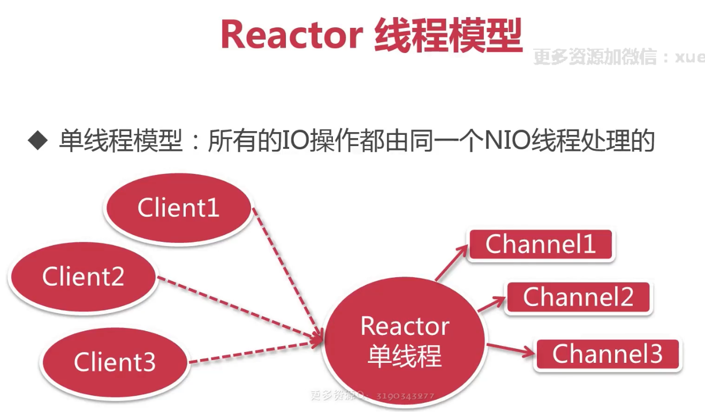
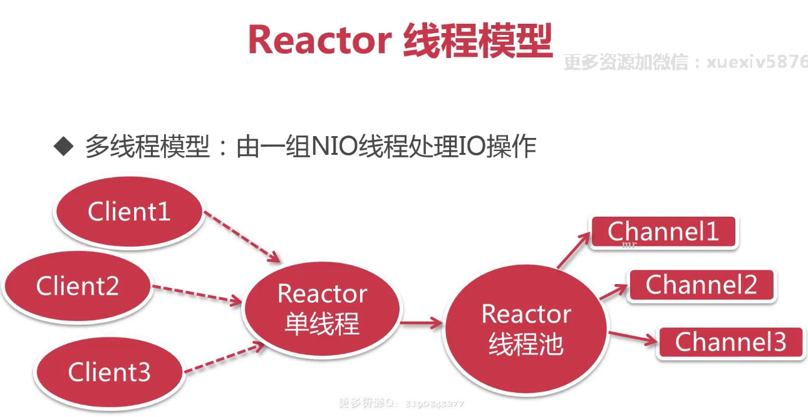
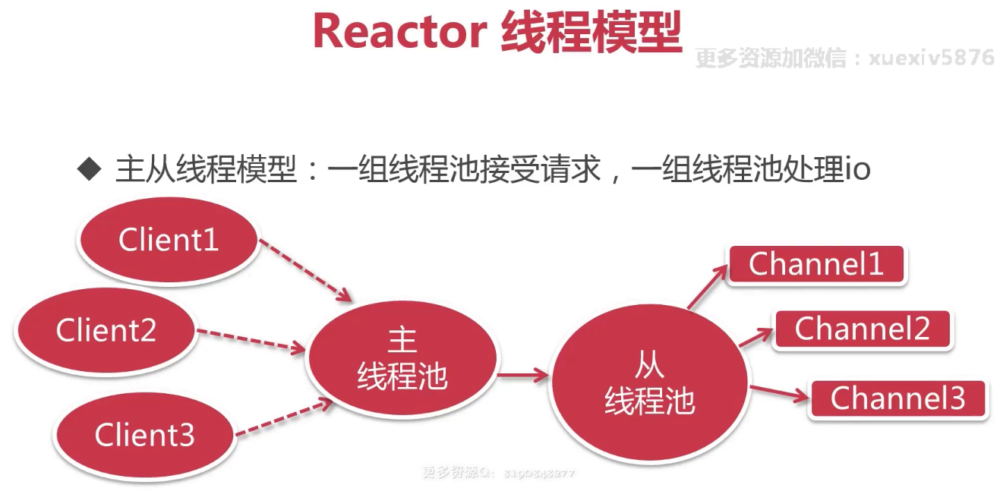

# Netty

* [Netty入门之WebSocket](Netty入门之WebSocket.md)
* [NettySpringboot仿微信聊天全栈实战](NettySpringboot仿微信聊天全栈实战.md)
* [Java读源码之Netty深入剖析](Java读源码之Netty深入剖析.md)

* [官网](https://netty.io/) 
* [GitHub](https://github.com/netty/netty)

## Netty是什么

1. 异步事件驱动框架，用于快速开发高性能服务端和客户端
2. 封装了JDK底层BIO和NIO模型，提供高度可用API
3. 自带编解码器解决拆包粘包问题，用户只关心业务逻辑
4. 精心设计的reactor线程模型支持高并发海量连接
5. 自带各种协议栈让你处理任何一种通用协议都几乎不用亲自动手（http、websocket）

* 本质：网络应该程序框架
* 实现：异步、事件驱动
* 特性：高性能、可维护、快速开发
* 用途：开发服务器和客户端

## 为什么舍近求远：不直接用JDK NIO

* Netty做到更多：

  * 支持常用应用层协议
  * 解决传输问题：粘包、半包现象
  * 支持流量整形
  * 完善的断连、Idle等异常处理等
  * 并发高 -NIO
  * 传输快 - 零拷贝

* Netty API 更友好更强大：

  * JDK的NIO一些API不够友好，功能薄弱，例如 ByteBuffer -> Netty's ByteBuf
  * 除了NIO以外，也提供了一些增强：Threadlocal -> Netty's FastThreadLocal

* Netty 隔离变化，屏蔽细节

  * 隔离JDK NIO的实现变化：nio -> nio2(aio) -> ...
  * 屏蔽了JDK NIO的实现细节

## 关于版本

* [https://netty.io/wiki/user-guide.html](https://netty.io/wiki/user-guide.html)
* 3.x -> jdk5
* 4.x -> 当前维护最新
* 5.x -> 停止维护

## Netty线程模型

* 单线程模型
* 多线程模型
* 主从线程模式（推荐：高效）

