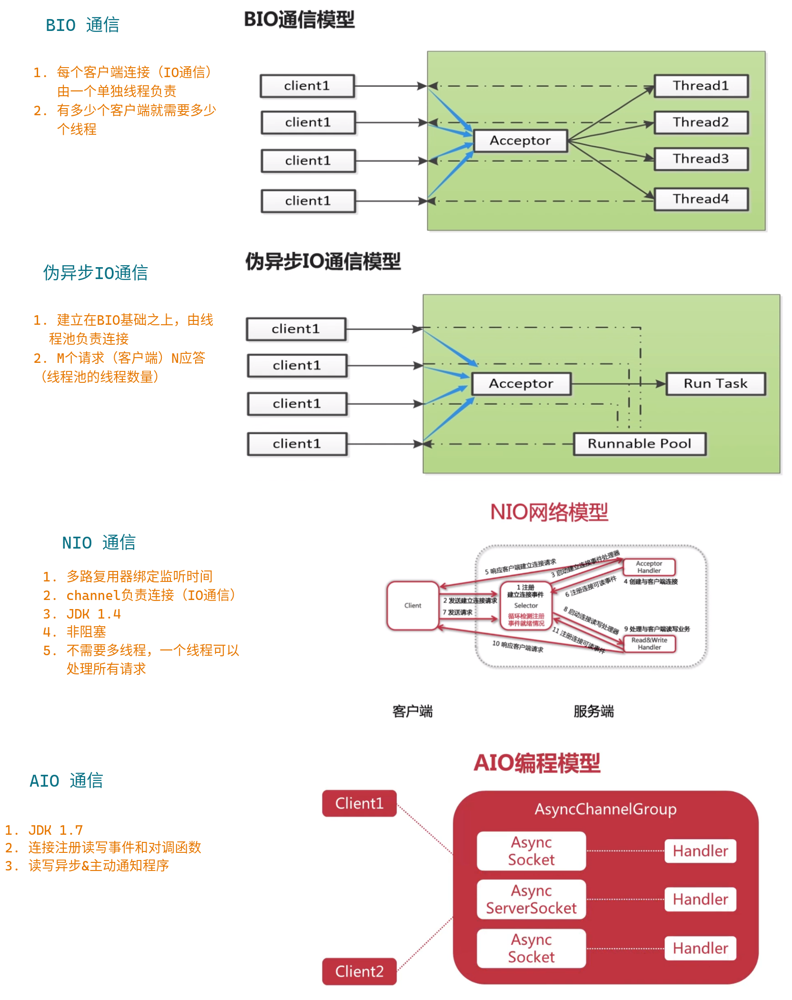
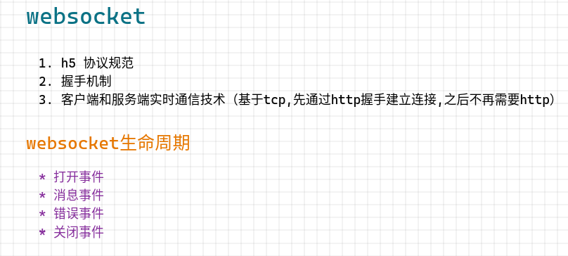

# Netty入门之WebSocket





| 类型     | client/thread | IO         | API难度 | 调试 | 吞吐量 | 可靠性 |
|----------|---------------|------------|---------|------|--------|--------|
| BIO      | m/m/          | 阻塞同步   | 简单    | 简单 | 低     | 差     |
| 伪异步IO | m/n           | 阻塞同步   | 简答    | 简答 | 中等   | 较差   |
| NIO      | m/1           | 非阻塞同步 | 难      | 难   | 高     | 高     |
| AIO      | m/0           | 非阻塞异步 | 难      | 难   | 高     | 高     |





## 环境

很遗憾，下面的代码运行有问题：

* jdk11
* implementation 'io.netty:netty-all:5.0.0.Alpha1'


```java
import io.netty.channel.group.ChannelGroup;
import io.netty.channel.group.DefaultChannelGroup;
import io.netty.util.concurrent.GlobalEventExecutor;

/**
 * 全局配置类
 */
public class NettyConfig {

    /**
     * 存储每一个客户端接入进来是的channel对象
     */
    public static ChannelGroup group = new DefaultChannelGroup(GlobalEventExecutor.INSTANCE);


}

```


```java

import io.netty.buffer.ByteBuf;
import io.netty.buffer.Unpooled;
import io.netty.channel.ChannelFuture;
import io.netty.channel.ChannelFutureListener;
import io.netty.channel.ChannelHandlerContext;
import io.netty.channel.SimpleChannelInboundHandler;
import io.netty.handler.codec.http.DefaultFullHttpResponse;
import io.netty.handler.codec.http.FullHttpRequest;
import io.netty.handler.codec.http.HttpResponseStatus;
import io.netty.handler.codec.http.HttpVersion;
import io.netty.handler.codec.http.websocketx.*;
import io.netty.util.CharsetUtil;


import java.util.Date;

/**
 * 接受、处理、响应客户端websocket请求的核心业务处理类
 */
public class MyWebSocketHandler extends SimpleChannelInboundHandler<Object> {


    private WebSocketServerHandshaker handshaker;

    private static final String WEB_SOCKET_URL = "ws://localhost:8888/websocket";


    /**
     * 电话发生异常的时候调用
     */
    @Override
    public void exceptionCaught(ChannelHandlerContext ctx, Throwable cause) throws Exception {
        cause.printStackTrace();
        ctx.close();
    }

    /**
     * 客户端和服务端创建连接的时候调用
     */
    @Override
    public void channelActive(ChannelHandlerContext ctx) throws Exception {
        NettyConfig.group.add(ctx.channel());
        System.out.println("客户端与服务端连接开启。。。");
    }

    /**
     * 客户端和服务端断开连接的时候调用
     */
    @Override
    public void channelInactive(ChannelHandlerContext ctx) throws Exception {
        NettyConfig.group.remove(ctx.channel());
        System.out.println("客户端与服务端连接关闭。。。");
    }

    /**
     * 服务端接受客户端发过来的数据结束之后调用
     */
    @Override
    public void channelReadComplete(ChannelHandlerContext ctx) throws Exception {
        ctx.flush();
    }

    /**
     * 服务端处理客户端websocket请求的核心方法
     */
    @Override
    protected void messageReceived(ChannelHandlerContext ctx, Object msg) throws Exception {
        //处理客户端向服务端发起http握手请求的业务
        if (msg instanceof FullHttpRequest){

            handHttpRequest(ctx, (FullHttpRequest) msg);

        //处理websocket连接业务
        }else if (msg instanceof WebSocketFrame){
            handWebsocketFrame(ctx, (WebSocketFrame) msg);
        }

    }

    /**
     * 处理客户端与服务端之间的websocket业务
     * @param ctx
     */
    private void handWebsocketFrame(ChannelHandlerContext ctx, WebSocketFrame frame){
        //是否是关闭websocket的指令
        if (frame instanceof CloseWebSocketFrame){
            handshaker.close(ctx.channel(), ((CloseWebSocketFrame) frame).retain());
        }
        //判断是否是ping消息
        if (frame instanceof PingWebSocketFrame){
            ctx.channel().write(new PongWebSocketFrame(frame.content().retain()));
            return;
        }

        //判断是否是二进制消息，如果是二进制消息，抛出异常
        if(!(frame instanceof TextWebSocketFrame)){
            System.out.println("目前我们不支持二进制消息");
            throw new RuntimeException("【" + this.getClass().getName() + "】不支持消息");
        }

        //返回应答消息
        //获取客户端向服务端发送的消息
        String request = ((TextWebSocketFrame)frame).text();
        System.out.println("服务端收到客户端的消息======>>>>>>>" + request);
        String responseMsg = new Date().toString() + ctx.channel().id() + "=====>>>>>>" + request;
        TextWebSocketFrame tws = new TextWebSocketFrame(responseMsg);

        //群发
        NettyConfig.group.writeAndFlush(tws);


    }


    /**
     * 处理客户端向服务端发起http握手请求的业务
     */
    private void handHttpRequest(ChannelHandlerContext ctx, FullHttpRequest req){
        if (!req.getDecoderResult().isSuccess() || !("websocket".equals(req.headers().get("Upgrade")))){
            sendHttpResponse(ctx, req, new DefaultFullHttpResponse(HttpVersion.HTTP_1_1, HttpResponseStatus.BAD_REQUEST));
            return;
        }
        WebSocketServerHandshakerFactory wsFactory = new WebSocketServerHandshakerFactory(WEB_SOCKET_URL, null, false);
        handshaker = wsFactory.newHandshaker(req);
        if (handshaker == null){
            WebSocketServerHandshakerFactory.sendUnsupportedWebSocketVersionResponse(ctx.channel());
        } else {
            handshaker.handshake(ctx.channel(), req);
        }
    }

    /**
     * 服务端向客户端响应消息
     */
    private void sendHttpResponse(ChannelHandlerContext ctx, FullHttpRequest req, DefaultFullHttpResponse res){

        if (res.getStatus().code() != 200){
            ByteBuf buf = Unpooled.copiedBuffer(res.getStatus().toString(), CharsetUtil.UTF_8);
            res.content().writeBytes(buf);
            buf.release();
        }
        //服务端向客户端发送数据
        ChannelFuture f = ctx.channel().writeAndFlush(res);
        if (res.getStatus().code() != 200){
            f.addListener(ChannelFutureListener.CLOSE);
        }

    }


}


```

```java

import io.netty.channel.ChannelInitializer;
import io.netty.channel.socket.SocketChannel;
import io.netty.handler.codec.http.HttpObjectAggregator;
import io.netty.handler.codec.http.HttpServerCodec;
import io.netty.handler.stream.ChunkedWriteHandler;


/**
 * 初始化连接时候的各个组件
 */
public class MyWebSocketChannelHandler extends ChannelInitializer<SocketChannel> {
    @Override
    protected void initChannel(SocketChannel e) throws Exception {

        e.pipeline().addLast("http-codec", new HttpServerCodec());
        e.pipeline().addLast("aggregator", new HttpObjectAggregator(65536));
        e.pipeline().addLast("http-chunked", new ChunkedWriteHandler());
        e.pipeline().addLast("handler", new MyWebSocketChannelHandler());


    }
}

```


```java

import io.netty.bootstrap.ServerBootstrap;
import io.netty.channel.Channel;
import io.netty.channel.EventLoopGroup;
import io.netty.channel.nio.NioEventLoopGroup;
import io.netty.channel.socket.nio.NioServerSocketChannel;

/**
 * 程序的入口，负责启动应用
 */
public class Main {

    public static void main(String[] args) {

        EventLoopGroup bossGroup = new NioEventLoopGroup();
        EventLoopGroup workGroup = new NioEventLoopGroup();
        try {
            ServerBootstrap serverBootstrap = new ServerBootstrap();
            serverBootstrap.group(bossGroup, workGroup);
            serverBootstrap.channel(NioServerSocketChannel.class);
            serverBootstrap.childHandler(new MyWebSocketChannelHandler());
            System.out.println("服务端开启等待客户端连接。。。");
            Channel ch = serverBootstrap.bind(8888).sync().channel();
            ch.closeFuture().sync();

        }catch (Exception e){
            e.printStackTrace();
        }finally {
            //优雅的退出程序
            bossGroup.shutdownGracefully();
            workGroup.shutdownGracefully();
        }

    }


}

```


```html

<html>
	<head>
		<meta http-equiv="Content-Type" content="text/html; charset = utf-8"/>
		<title>WebSocket客户端</title>
	<script type="text/javascript">
		var socket;
		if(!window.WebSocket){
			window.WebSocket = window.MozWebSocket;
		}

		if(window.WebSocket){
			socket = new WebSocket("ws://localhost:8888/websocket");
			socket.onmessage = function(event){
				var ta = document.getElementById('responseContent');
				ta.value += event.data + "\r\n";
			};

			socket.onopen = function(event){
				var ta = document.getElementById('responseContent');
				ta.value = "你当前的浏览器支持WebSocket,请进行后续操作\r\n";
			};

			socket.onclose = function(event){
				var ta = document.getElementById('responseContent');
				ta.value = "";
				ta.value = "WebSocket连接已经关闭\r\n";
			};
		}else{
			alert("您的浏览器不支持WebSocket");
		}


		function send(message){
			if(!window.WebSocket){
				return;
			}
			if(socket.readyState == WebSocket.OPEN){
				socket.send(message);
			}else{
				alert("WebSocket连接没有建立成功！！");
			}
		}
	</script>
	</head>
	<body>
		<form onSubmit="return false;">
			<input type = "text" name = "message" value = ""/>
			<br/><br/>
			<input type = "button" value = "发送WebSocket请求消息" onClick = "send(this.form.message.value)"/>
			<hr color="red"/>
			<h2>客户端接收到服务端返回的应答消息</h2>
			<textarea id = "responseContent" style = "width:1024px; height:300px"></textarea>
		</form>
	</body>
</html>

```


