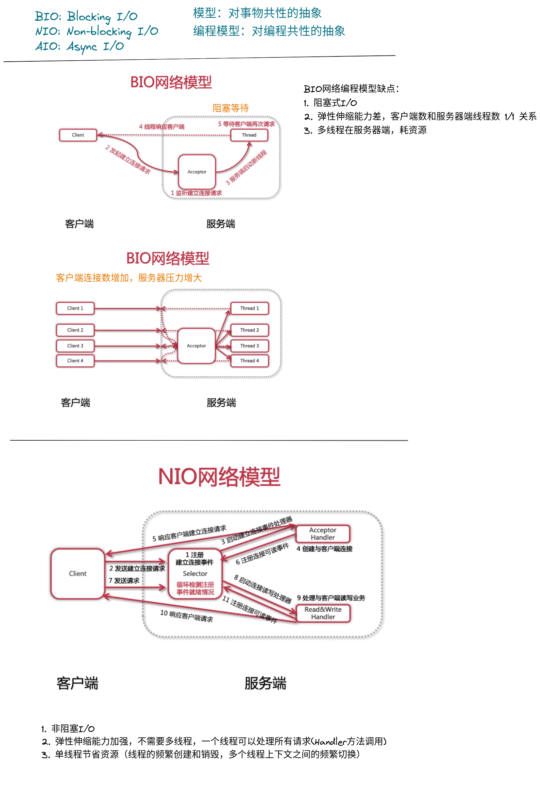
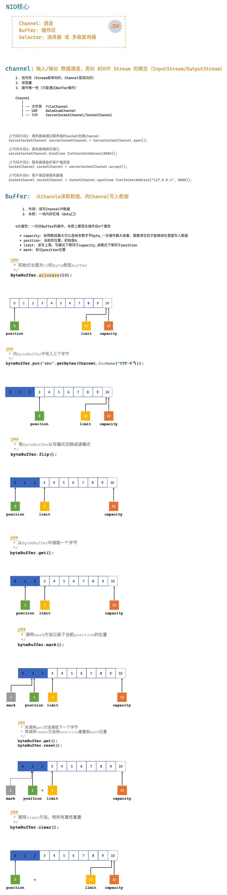
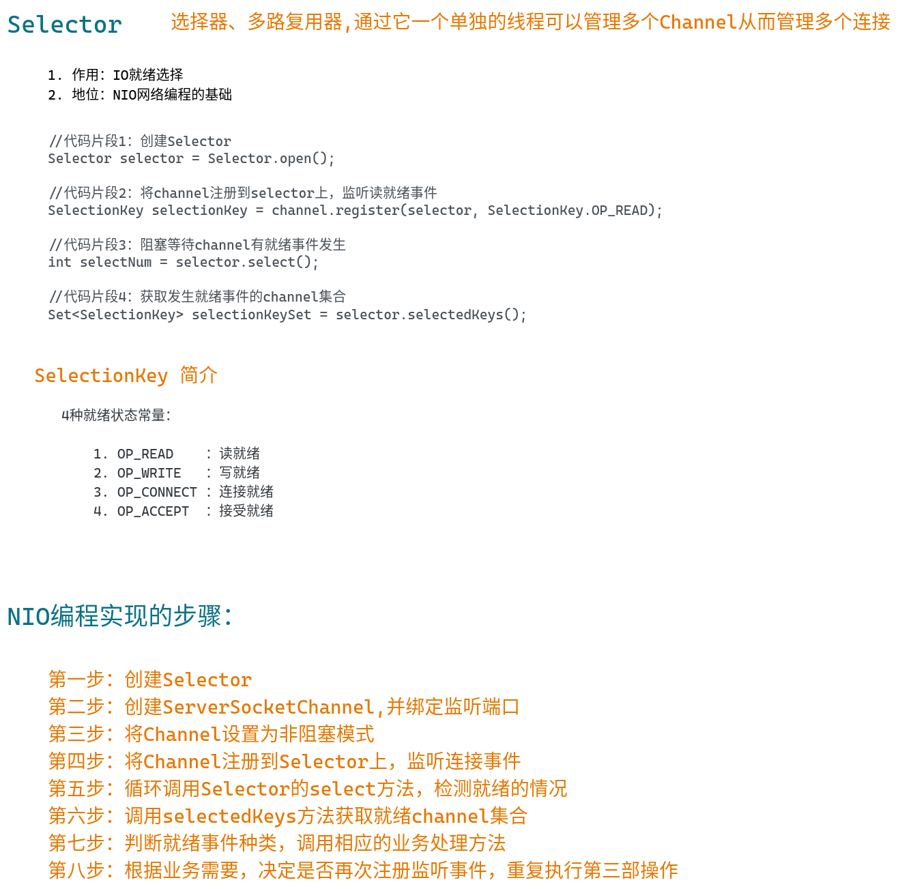

# 解锁网络编程之NIO的前世今生

## 理论知识




## NIO网络编程详解








## NIO网络编程实战


```java


import java.io.IOException;
import java.net.InetSocketAddress;
import java.nio.ByteBuffer;
import java.nio.channels.*;
import java.nio.charset.StandardCharsets;
import java.util.Iterator;
import java.util.Set;

/**
 * @author user
 */
public class NIOServer {

    public static void main(String[] args) throws IOException {

        NIOServer nioServer = new NIOServer();
        nioServer.start();

    }

    /**
     * 启动
     */
    private void start() throws IOException {


        //1. 创建一个selector
        Selector selector = Selector.open();

        //2. 通过ServerSocketChannel 创建channel通道
        ServerSocketChannel serverSocketChannel = ServerSocketChannel.open();

        //3. 为channel绑定监听端口
        serverSocketChannel.bind(new InetSocketAddress(8000));

        //4. 设置channel为非阻塞模式
        serverSocketChannel.configureBlocking(false);

        //5. 将channel注册到selector上，监听连接事件
        serverSocketChannel.register(selector, SelectionKey.OP_ACCEPT);

        System.out.println("服务器启动成功。。。");

        //6. 循环等待新接入的连接
        while (true){
            //获取可用的channel数量
            int readyChannels = selector.select();
            if (readyChannels == 0) {
                continue;
            }
            //获取可用的channel集合
            Set<SelectionKey> selectedKeysSet = selector.selectedKeys();
            Iterator<SelectionKey> iterator = selectedKeysSet.iterator();
            while (iterator.hasNext()){
                SelectionKey selectionKey = iterator.next();

                //取出来以后处理后就可用移除了
                iterator.remove();

                //7. 根据就绪状态，调用处理业务方法处理逻辑

                //7.1 如果是接受事件
                if (selectionKey.isAcceptable()){
                    this.acceptHandler(serverSocketChannel, selector);
                }
                //7.2 如果是可读事件
                if(selectionKey.isReadable()){
                    this.readHandler(selectionKey, selector);
                }
            }

        }
    }


    /**
     * 接入事件处理器
     */
    private void acceptHandler(ServerSocketChannel serverSocketChannel, Selector selector) throws IOException {

        //如果是接入事件，创建socketChannel
        SocketChannel socketChannel = serverSocketChannel.accept();

        //将socketChannel设置为非阻塞工作模式
        socketChannel.configureBlocking(false);

        //channel注册到selector上,监听可读事件
        socketChannel.register(selector, SelectionKey.OP_READ);

        //回复客户端，提示信息
        socketChannel.write(StandardCharsets.UTF_8.encode("你与聊天室其他好友都不上朋友关系，请注意隐私安全"));

    }

    /**
     * 可读事件处理器
     */
    private void readHandler(SelectionKey selectionKey, Selector selector) throws IOException {

        //1. 从selectionKey 中获取到已近就绪的channel
        SocketChannel socketChannel = (SocketChannel) selectionKey.channel();

        //2. 创建buffer读写channel
        ByteBuffer byteBuffer = ByteBuffer.allocate(1024);

        //3. 循环读取客户端请求信息
        String info = "";
        while(socketChannel.read(byteBuffer) > 0){
            //切换buffer为读模式
            byteBuffer.flip();
            info += StandardCharsets.UTF_8.decode(byteBuffer);
        }

        //4. 再次将channel注册到selector上，监听其他的可读信息
        socketChannel.register(selector, SelectionKey.OP_READ);

        //5. 将客户端发送的请求信息，广播给其他客户端
        if (info.length() > 0){
            System.out.println("::" + info);
            boardCast(selector, socketChannel, info);
        }

    }


    /**
     * 广播给其他客户端
     */
    private void boardCast(Selector selector, SocketChannel sourceChannel, String info){

        //获取到所有已进入的客户端channel
        Set<SelectionKey> selectionKeySet = selector.keys();
        //循环向所有channel广播信息
        selectionKeySet.forEach(selectionKey -> {
            Channel targetChannel = selectionKey.channel();
            // 剔除发消息的客户端
            if (targetChannel instanceof SocketChannel && targetChannel != sourceChannel){
                try {
                    //将消息发送到targetchannel客户端
                    ((SocketChannel)targetChannel).write(StandardCharsets.UTF_8.encode(info));
                } catch (IOException e) {
                    e.printStackTrace();
                }
            }
        });
    }


}


```


```java


import java.io.IOException;
import java.net.InetSocketAddress;
import java.nio.ByteBuffer;
import java.nio.channels.SelectionKey;
import java.nio.channels.Selector;
import java.nio.channels.SocketChannel;
import java.nio.charset.StandardCharsets;
import java.util.Iterator;
import java.util.Scanner;
import java.util.Set;

public class NIOClient {

    public static void main(String[] args) throws IOException {

        NIOClient nioClient = new NIOClient();
        nioClient.start();
    }

    /**
     * 启动
     */
    private void start() throws IOException {
        //1. 连接服务器端
        SocketChannel socketChannel = SocketChannel.open(new InetSocketAddress("127.0.0.1", 8000));


        Selector selector = Selector.open();
        socketChannel.configureBlocking(false);
        socketChannel.register(selector, SelectionKey.OP_READ);


        //3. 接受服务器端响应
        //新开线程，专门负责来接受服务器端的响应数据
        new Thread(new Runnable(){
            @Override
            public void run() {
                try {
                    while (true){
                        //获取可用的channel数量
                        int readyChannels = selector.select();
                        if (readyChannels == 0) {
                            continue;
                        }
                        //获取可用的channel集合
                        Set<SelectionKey> selectedKeysSet = selector.selectedKeys();
                        Iterator<SelectionKey> iterator = selectedKeysSet.iterator();
                        while (iterator.hasNext()){
                            SelectionKey selectionKey = iterator.next();

                            //取出来以后处理后就可用移除了
                            iterator.remove();

                            //7. 根据就绪状态，调用处理业务方法处理逻辑

                            //7.2 如果是可读事件
                            if(selectionKey.isReadable()){
                                this.readHandler(selectionKey, selector);
                            }
                        }

                    }
                }catch (IOException e){
                    e.printStackTrace();
                }
            }


            /**
             * 可读事件处理器
             */
            private void readHandler(SelectionKey selectionKey, Selector selector) throws IOException {

                //1. 从selectionKey 中获取到已近就绪的channel
                SocketChannel socketChannel = (SocketChannel) selectionKey.channel();

                //2. 创建buffer读写channel
                ByteBuffer byteBuffer = ByteBuffer.allocate(1024);

                //3. 循环读取服务器端响应信息
                String info = "";
                while(socketChannel.read(byteBuffer) > 0){
                    //切换buffer为读模式
                    byteBuffer.flip();
                    info += StandardCharsets.UTF_8.decode(byteBuffer);
                }

                //4. 再次将channel注册到selector上，监听其他的可读信息
                socketChannel.register(selector, SelectionKey.OP_READ);

                //5. 将服务器端响应信息打印到本地
                if (info.length() > 0){
                    System.out.println("::" + info);
                }

            }
        }).start();


        //2. 向服务器端发送数据
        Scanner scanner = new Scanner(System.in);
        while (scanner.hasNextLine()){
            String info = scanner.nextLine();
            if (info != null && info.length() > 0){
                socketChannel.write(StandardCharsets.UTF_8.encode(info));
            }
        }


    }


}


```


