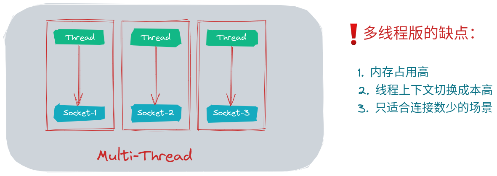
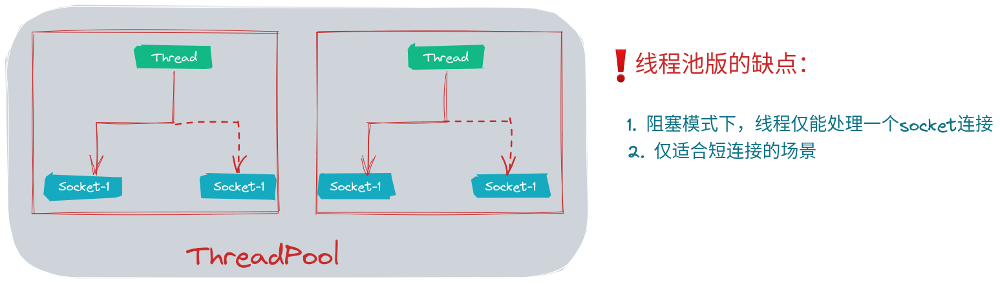
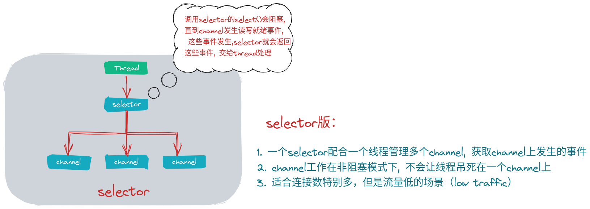

# 黑马程序员Netty全套教程，全网最全Netty深入浅出教程，Java网络编程的王者

## NIO

NIO: non-blocking io 也叫 new io

### NIO 3大组件：

* channel：数据传输的双向通道
* buffer: 暂存数据的内存缓存区, 应用程序与文件、网络之间数据的桥梁
* selector：

> 1. channel有一点类似stream, 它是读写数据的双向通道，可以从channel将数据读入buffer, 也可以将buffer的数据写入channel,而之前的stream要么是输入、要么是输出，channel比stream更为底层  
> 2. channel <<<--双向传输-->>> buffer

### 常见的Channel有：

* FileChannel: 文件使用
* DatagramChannel：udp使用
* SocketChannel：tcp, 服务端和客户端都可以使用
* ServerScoketChannel: tcp, 主要服务端使用

### buffer 用来缓存读写数据，常见的buffer有：

* ByteBuffer <<=== **抽象类，使用最多的buffer,最常见**
  - MappedByteBuffer
  - DirectByteBuffer
  - HeapByteBuffer
* ShortBuffer
* IntBuffer
* LongBuffer
* FloatBuffer
* DoubleBuffer
* CharBuffer

### selector

selector 单从字面意思不好理解，需要结合服务器的设计演化来理解它的用途

-----

-----

