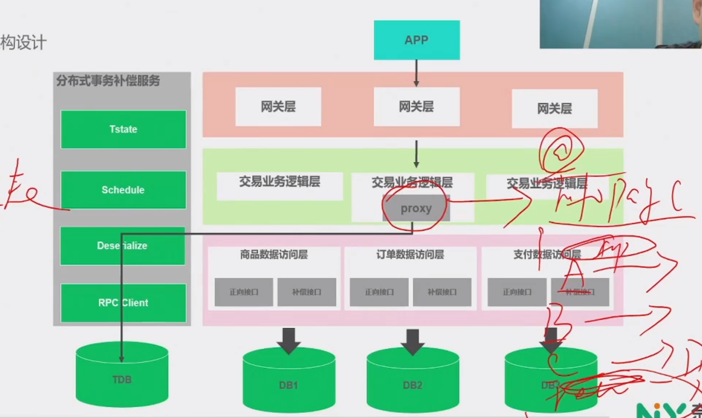

## 1. Sagas模型剖析

1. 把一个分布式事物拆分成多个本地事物，每个本地事物都有相应的执行模块和补偿模块
2. 当Sagas事物中任一个本地事物出错，通过调用补偿方法恢复之前的事物，达到事物最终一致性。
3. 当每个Sagas子事物T~1~,T~2~...T~N~都有响应的补偿定义C~1~,C~2~...C~n-1~,那么Sagas系统可以保证：
    * 子事物序列可以得以完成（最佳情况）
    * 或者序列T~1~,T~2~...T~j~,C~j-1~,...,C~2~,C~1~得以完成

## 2. Sagas隔离性

* 业务层并发控制

    * 在应用层加锁
    * 在应用层预先冻结资源等

> 正常情况下是串行执行

## 3. Sagas恢复方式

* **向后恢复**，补偿所有已完成的事物，如果任一子任务失败。
* **向前恢复**，重试失败的事物，假设每个子事物最终都会成功。

## 4. Sagas架构设计3大关键技术

1. 异步补偿机制
2. 幂等补偿接口
3. 记录请求调用链路

## 5. Sagas失败

* 记录错误日志
* 报警
* 人工智能
    * 人工介入

## 6. 开源实现

1. Saga(华为开源)

    * Apache ServiceComb的Saga实现模块
    * Apache ServiceComb中的Saga模块是微服务应用的数据最终一致性解决方
    * [官方][servicecomb官方] 
    * [github][servicecomb github] 

2. Seata(阿里开源)

    * Seata是阿里巴巴开源的分布式解决方案，目标：高性能、简单易用
    * 支持多种模式

      * 支持多种微服务框架：Dubbo、grpc、spring cloud
      * at模式
      * tcc模式
      * saga模式
      * xa模式

    * [http://seata.io/zh-cn][seata官方] 

[servicecomb官方]: http://servicecomb.apache.org/cn/ 
[servicecomb github]: https://github.com/apache/servicecomb-saga-actuator
[seata官方]: http://seata.io/zh-cn

