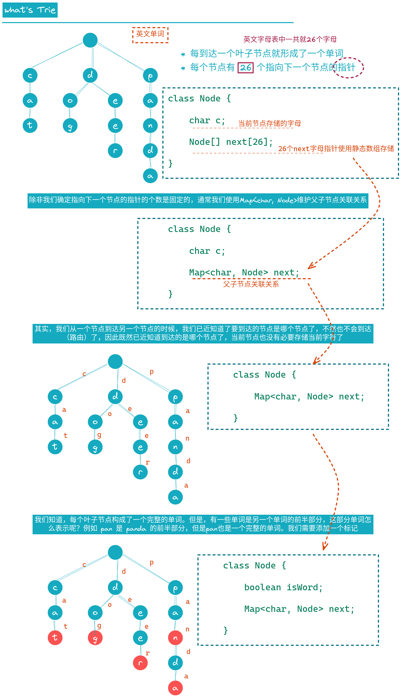
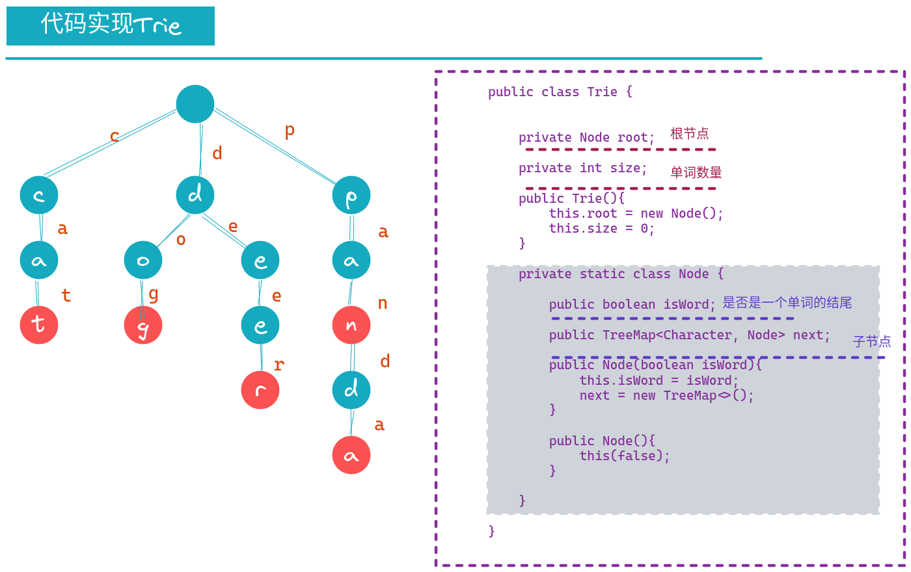

# 字典树 - Trie


## 什么是Trie


* 专门的、真正的为“字典”设计的数据结构
* 通常Trie只用来处理 字符串


| 存储类型 | 时间复杂度                                                                            |
|----------|---------------------------------------------------------------------------------------|
| 字典     | 如果有n个条目,使用树结构,查询的时间复杂度就是O(logn) 如果有100万个条目 （2^20^）      |
| Trie     | 查询每个条目的时间复杂度,和字典中一共有多少个条目无关！时间复杂度为O(w) w为单词的长度 |



> 为什么是26？因为字母表一共只有26个字母吗？
> 其实不是。这个是要根据我们要装载的数据的类型决定的。如果我们装载的数据是单词，那么就是26个小写的英文字母
> 如果我们要装载的单词区分大小写，那么就有26*2个子节点，如果装载的数据类型是网址，那么还要包含特殊字符等
> 所以，通常我们会让每个节点指向若干个下个节点的指针,怎么表示呢？用映射`Map<Character, Node>`维护字符和next节点指针关系


> 我们的映射关系一定是`Character`吗？其实也不是，我们这里存储单词的话，单词拆分出来的最小单元是字母，我们用`Character`
> 我们还可以存储汉语、韩语、日语等。只要能分割成一个一个的单元，这一个一个的单元就不一定是字母了（算法学习的是思想，根据业务存储的数据特点，灵活应用）


## 代码实现Trie




```java
package trie;

import java.util.TreeMap;

public class Trie {


    private Node root;

    private int size;

    public Trie(){
        this.root = new Node();
        this.size = 0;
    }

    /**
     * 获取单词数量
     */
    public int getSize(){
        return size;
    }


    /**
     * 是否包含某一个单词
     */
    public boolean contains(String word){
        Node curr = root;
        for (int i = 0; i < word.length(); i++) {
            char c = word.charAt(i);
            if (curr.next.get(c) == null){
                return false;
            }
            curr = curr.next.get(c);
        }

        return curr.isWord;
    }


    /**
     * 是否有前缀
     */
    public boolean isPrefix(String prefix){
        Node curr = root;
        for (int i = 0; i < prefix.length(); i++) {
            char c = prefix.charAt(i);
            if (curr.next.get(c) == null){
                return false;
            }
            curr = curr.next.get(c);
        }

        return true;
    }


    /**
     * 添加一个单词
     */
    public void add(String word){

        //循环实现
        Node curr = root;
        for (int i = 0; i < word.length(); i++) {
            char c = word.charAt(i);
            if (curr.next.get(c) == null) {
                curr.next.put(c, new Node());
            }
            curr = curr.next.get(c);

        }

        if (!curr.isWord){
            curr.isWord = true;
            size++;
        }


        //递归实现
        //add(root, word);
    }

    /**
     * 递归函数：宏观语意：向父节点添加单词的第一个字母
     */
    private void add(Node parent, String word){

        char c = word.charAt(0);
        if (parent.next.get(c) == null){
            parent.next.put(c, new Node());
        }
        Node  node = parent.next.get(c);

        if (word.length() == 1){
            if (!node.isWord){
                node.isWord = true;
                size++;
                return;
            }
        }
        add(node, word.substring(1));

    }


    private static class Node {

        public boolean isWord;

        public TreeMap<Character, Node> next;

        public Node(boolean isWord){
            this.isWord = isWord;
            next = new TreeMap<>();
        }

        public Node(){
            this(false);
        }

    }

}

```


