# 二分搜索树

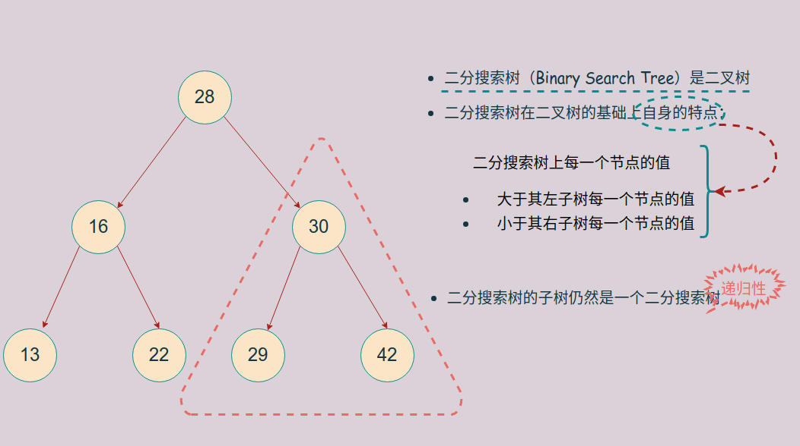


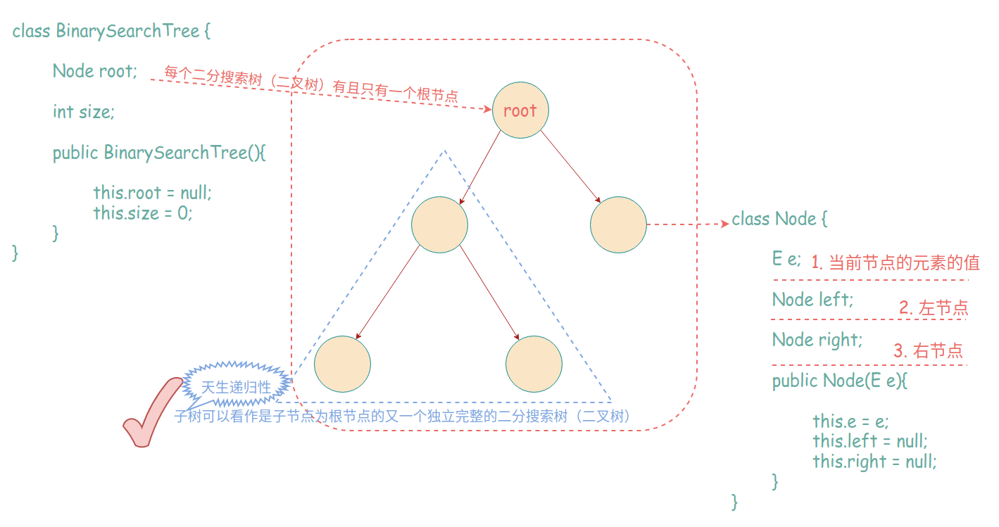

## 二分搜索树的遍历

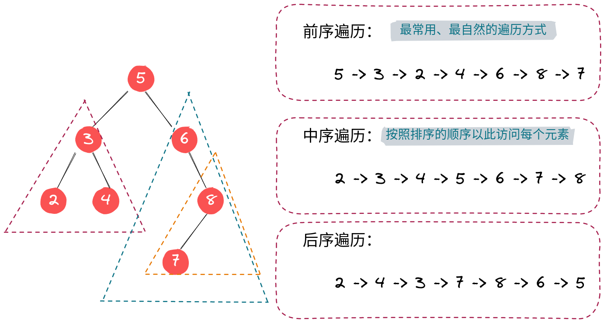

### 前序遍历

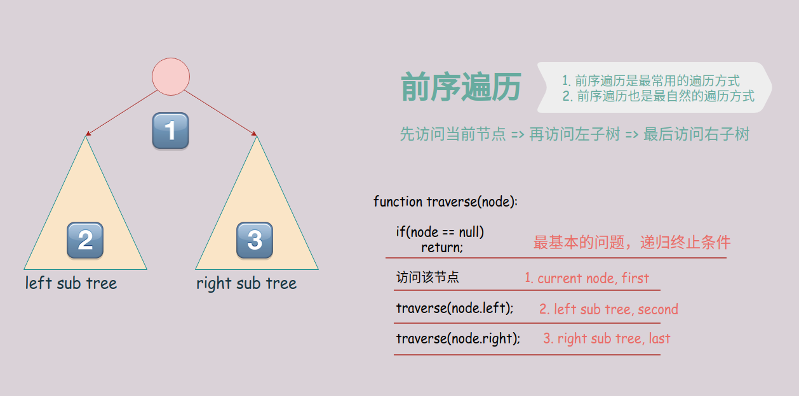

> 前序遍历是最自然的遍历方式
> 前序遍历也是最常用的遍历方式


### 中序遍历

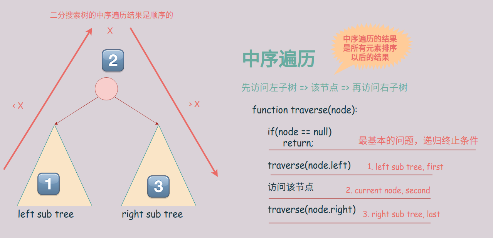

> 二分搜索树基于二叉树的基础上，满足左小右大的规则。因此，中序遍历访问节点元素的顺序是按照元素排好序的结果有小到大顺序访问的。

### 后序遍历


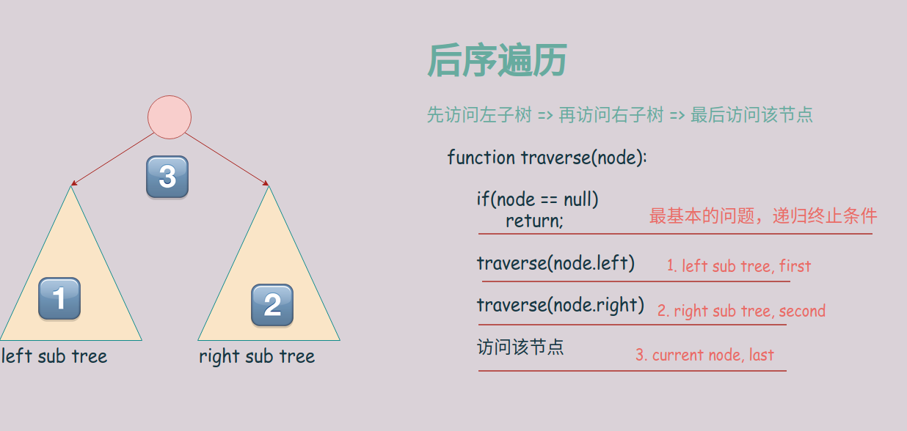

### 前序遍历的非递归实现

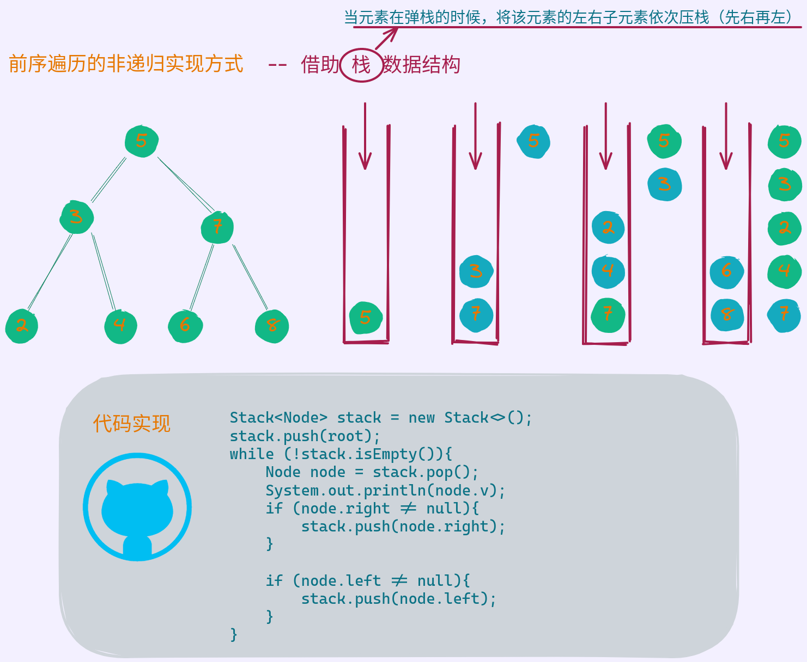

### 层次遍历

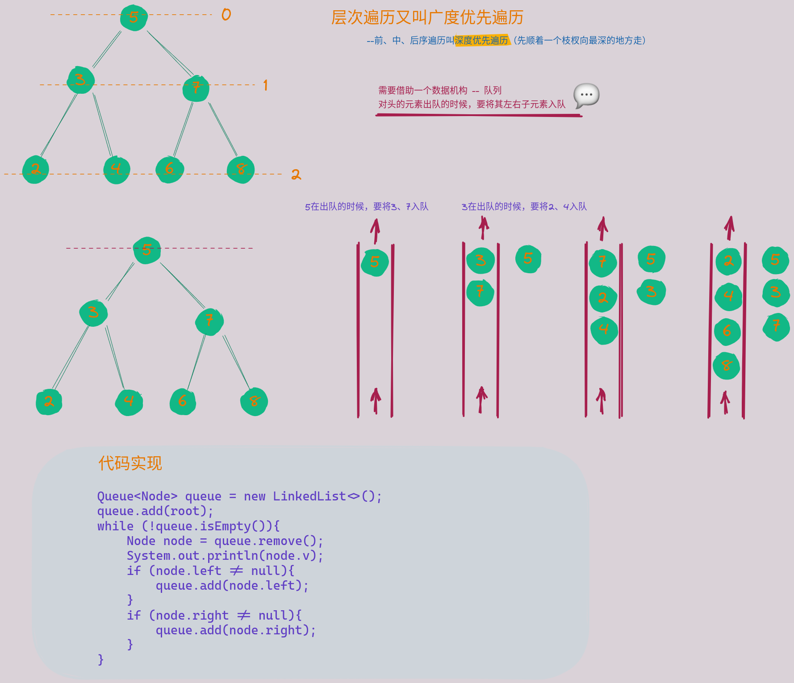


### 时间复杂度

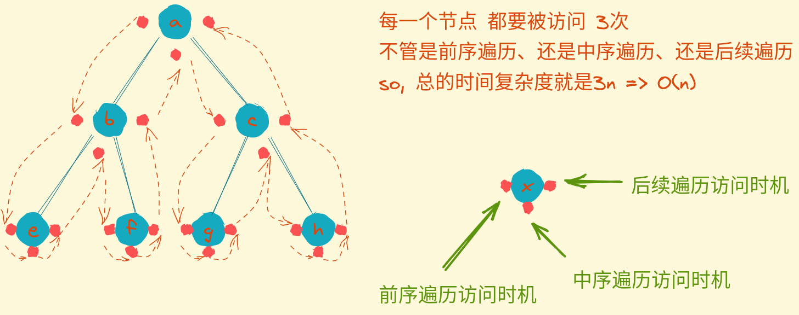

## 删除元素

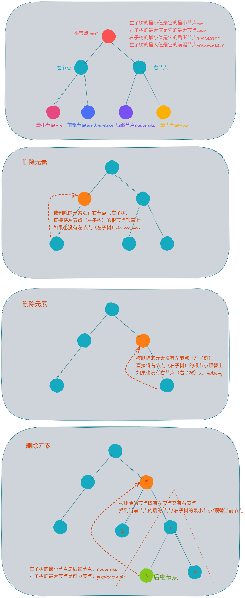

## 二分搜索树的变种

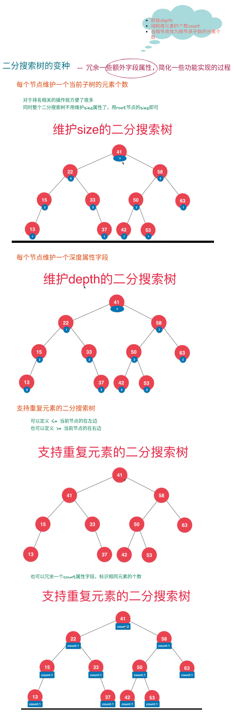

## 二分搜索树操作相关代码演示

```java
import java.util.LinkedList;
import java.util.Queue;
import java.util.Stack;

/**
 * @author user
 */
public class BinarySearchTree {


    private Node root;

    private int size;

    public BinarySearchTree() {
        this.root = null;
        this.size = 0;
    }

    public int size(){
        return this.size;
    }

    public boolean isEmpty(){
        return size == 0;
    }

    /**
     * 添加元素
     */
    public void add(int v){
       this.root = add(root, v);
        size++;
    }

    /**
     * 递归，宏观语意:向以node为根节点的二分搜索树插入元素v
     * 返回二分搜索树的根节点
     */
    private Node add(Node node, int v){
        //解决最基本的问题，递归终止条件
        if (node == null){
            return new Node(v);
        }
        //将问题拆分成更小的问题
        if(node.v > v){
            //父问题和子问题的关系
            node.left = add(node.left, v);
        }
        if(node.v < v){
            node.right = add(node.right, v);
        }

        return node;
    }


    public boolean contains(int e){
        return contains(root, e);
    }

    /**
     * 递归函数：宏观语意 - node为根节点的二分搜索树是否包含元素e
     *
     */
    private boolean contains(Node node, int e){
        if (node == null) {
            return false;
        }
        if (node.v == e){
            return true;
        }
        if (node.v > e){
            return contains(node.left, e);
        }
        return contains(node.right, e);
    }

    /**
     * 后续遍历
     */
    public void postOrder(){
        postOrder(root);
    }
    private void postOrder(Node node){
        if (node == null){
            return;
        }
        postOrder(node.left);
        postOrder(node.right);
        System.out.println(node.v);
    }

    /**
     * 中序遍历
     */
    public void inOrder(){
        inOrder(root);
    }

    private void inOrder(Node node){
        if (node == null) {
            return;
        }
        inOrder(node.left);
        System.out.println(node.v);
        inOrder(node.right);

    }


    /**
     * 前序遍历
     */
    public void preOrder(){
        preOrder(root);
    }

    /**
     * 前序遍历的非递归写法
     * 广度优先遍历
     * 借助数据结构栈
     */
    public void preOrder2(){
        Stack<Node> stack = new Stack<>();
        stack.push(root);
        while (!stack.isEmpty()){
            Node node = stack.pop();
            System.out.println(node.v);
            if (node.right != null){
                stack.push(node.right);
            }

            if (node.left != null){
                stack.push(node.left);
            }
        }

    }

    /**
     * 层次遍历
     * 广度优先遍历
     */
    public void preOrder3(){

        Queue<Node> queue = new LinkedList<>();
        queue.add(root);
        while (!queue.isEmpty()){
            Node node = queue.remove();
            System.out.println(node.v);
            if (node.left != null){
                queue.add(node.left);
            }
            if (node.right != null){
                queue.add(node.right);
            }
        }

    }


    private void preOrder(Node node){

        if (node == null){
            return;
        }

        System.out.println(node.v);
        preOrder(node.left);
        preOrder(node.right);

    }

    /**
     * 删除最大值
     */
    public int removeMax(){
        int maximum = maximum();
        root = removeMax(root);
        return maximum;
    }

    /**
     * 递归函数，宏观语意
     * 删除以node为根的二分搜索树的最大节点
     * 返回删除节点后新的二分搜索树的根
     */
    public Node removeMax(Node node){
        if (null == node.right){
            Node leftNode = node.left;
            node.left = null;
            size--;
            return leftNode;
        }
        node.right = removeMax(node.right);
        return node;
    }

    /**
     * 删除元素
     */
    public void remove(int v){
       root = remove(root, v);
    }

    /**
     * 递归函数，宏观语意
     * 删除以node为根节点的二分搜索树的指定节点，并返回新的根节点
     */
    private Node remove(Node node, int v){
        if (node == null){
            return null;
        }

        if (v == node.v){
            if (node.left == null){
                Node rightNode = node.right;
                node.right = null;
                size--;
                return rightNode;
            }else if (node.right == null){
                Node leftNode = node.left;
                node.left = null;
                size--;
                return leftNode;
            }else {
                Node successor = minimum(node.right);
                successor.right = removeMin(node.right);
                successor.left = node.left;
                node.left = node.right = null;
                return successor;
            }
        }

        if (v < node.v){
            node.left = remove(node.left, v);
            return node;
        }else {
            node.right = remove(node.right, v);
            return node;
        }

    }


    /**
     * 删除最小值
     */
    public int removeMin(){
        int minimum = minimum();
        root = removeMin(root);
        return minimum;
    }


    /**
     * 递归函数，宏观语意
     * 删除以node为根的二分搜索树的最小节点
     * 返回删除节点后新的二分搜索树的根
     */
    private Node removeMin(Node node){
        if (node.left == null){
            Node rightNode = node.right;
            node.right = null;
            size--;
            return rightNode;
        }
        node.left = removeMin(node.left);
        return node;
    }

    /**
     * 寻找二分搜索树的最大值
     */
    public int maximum(){
        if(size == 0){
            throw new IllegalStateException("bst is empty");
        }
        Node maximum = maximum(root);
        return maximum.v;
    }

    /**
     * 递归函数，宏观语意，返回以node为根节点的二分搜索树的最大节点
     */
    private Node maximum(Node node){
        if (node.right == null){
            return node;
        }
        return maximum(node.right);
    }

    /**
     * 寻找二分搜索树的最小值
     */
    public int minimum(){
        if (size == 0){
            throw new IllegalStateException("bst is empty");
        }
        Node minimum = minimum(root);
        return minimum.v;
    }

    /**
     * 递归：宏观语意，返回以node为根节点的二分搜索树的最小节点
     */
    private Node minimum(Node node){
        if (node.left == null){
            return node;
        }
        return minimum(node.left);
    }


    @Override
    public String toString() {
        StringBuilder stringBuilder = new StringBuilder();
        generateBSTString(root, 0, stringBuilder);
        return stringBuilder.toString();
    }

    private void generateBSTString(Node node, int depth, StringBuilder stringBuilder) {

        if (node == null){
            stringBuilder.append(generateDepthString(depth) + "null\n");
            return;
        }

        stringBuilder.append(generateDepthString(depth) + node.v + "\n");
        generateBSTString(node.left, depth+1, stringBuilder);
        generateBSTString(node.right, depth + 1, stringBuilder);


    }

    private String generateDepthString(int depth) {
        StringBuilder stringBuilder = new StringBuilder();
        for (int i = 0; i < depth; i++) {
            stringBuilder.append("--");
        }
        return stringBuilder.toString();
    }

    private static class Node{
        public int v;

        public Node left, right;

        public Node(int v) {
            this.v = v;
            this.left = null;
            this.right = null;
        }
    }


}

```


