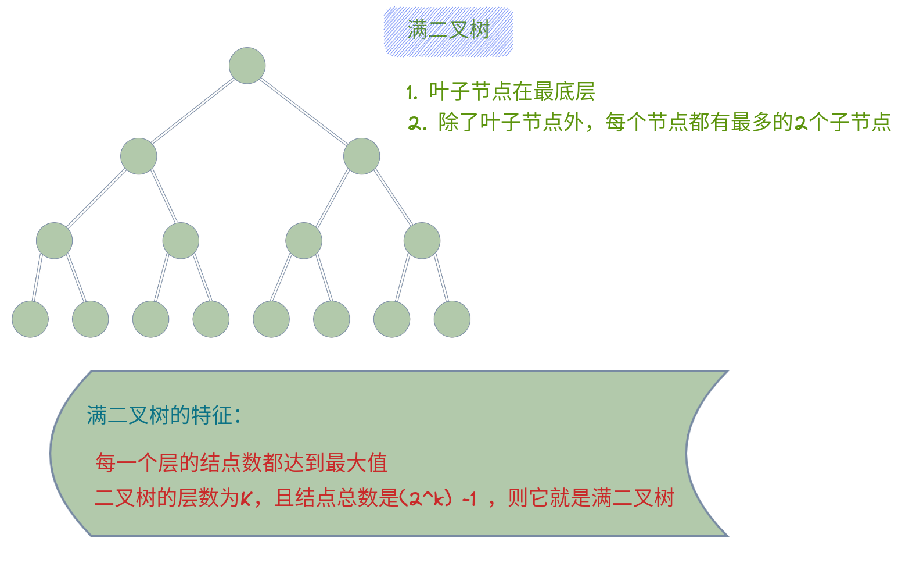

# 二叉树

> * **递归性：** root节点的左（右）子树又可以看成是以左（右）子节点为根节点的二叉树
> * **边界条件：** 一个节点可以看成是一个二叉树，null也可以看成是一个二叉树

## 二叉树的高度、深度和层

## 满二叉树和完全二叉树

> * Perfect Binary Tree（满二叉树）
> 除了叶子节点之外的每个节点都有两个孩子，每一层当然包含最后一层，都被完全填充 
> Every node except the leaf nodes have two children and every level (last level too) is completely filled.
> * Full Binary Tree (完满二叉树)
> 除了叶子结点之外的每一个结点都有两个孩子结点 
> Every node except the leaf nodes have two children.
> * Complete Binary Tree (完全二叉树)
> 除了最后一层之外的其他每一层都被完全填充，并且所有结点都保持向左对齐 
> Every level except the last level is completely filled and all the nodes are left justified.

