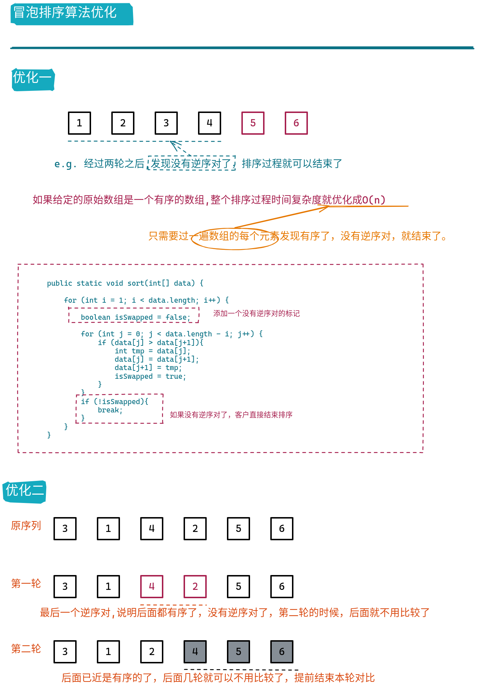

# 冒泡排序法

* 基于选择的排序算法
* O(n^2^)
* 排序的思路在生活中并不常见
* 基本思想,两两比较找最大值


## 代码实现

```java
/**
 * 冒泡排序算法
 */
public static void sort(int[] data) {

    for (int i = 1; i < data.length; i++) {
        for (int j = 0; j < data.length - i; j++) {
            if (data[j] > data[j+1]){
                int tmp = data[j];
                data[j] = data[j+1];
                data[j+1] = tmp;
            }
        }
    }
}
``` 
## 优化




