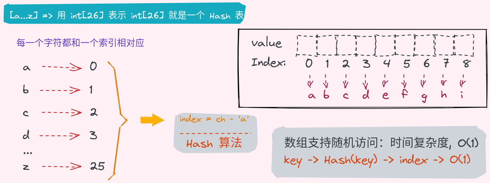
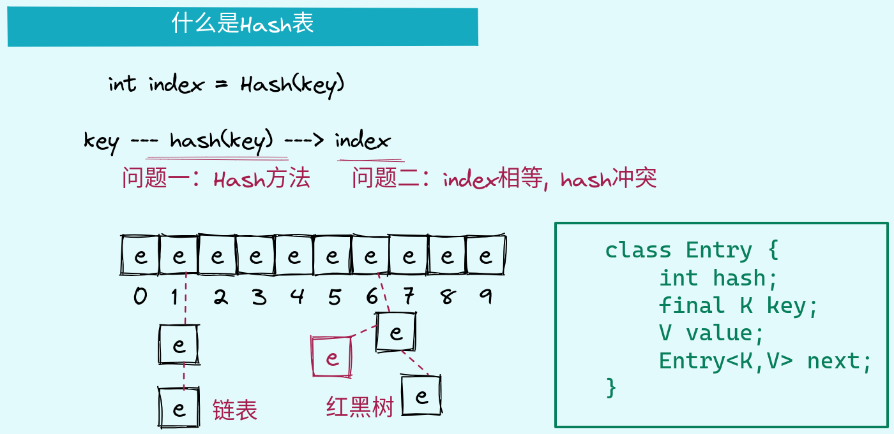
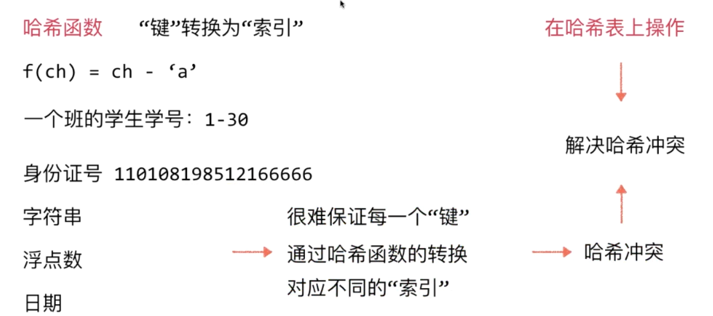

# 哈希表

1. 相对比较简单的数据结构

> :alien: 尽管对Hash表有很多相对复杂的研究，这些研究大多偏数学，对于普通的开发来讲，我们使用Hash表，了解Hash表的底层实现。不需要知道那么多复杂深奥的内容知道

看一个leetcode No.387 问题

    给定一个字符串 s ，找到 它的第一个不重复的字符，并返回它的索引 。如果不存在，则返回 -1 。
    class Solution {
        public int firstUniqChar(String s) {
             // 将字符串26个小写字母映射到一个int数组中
             int[] arr = new int[26];

            for (int i = 0; i < s.length(); i++) {
                //字符和int数组的对应关系
                arr[s.charAt(i) - 'a']++;
            }
            // 重新访问字符串，找第一个值为1的字符的索引
            for (int i = 0; i < s.length(); i++) {
                if (arr[s.charAt(i) - 'a'] == 1){
                    return i;
                }
            }

            return -1;
        }
    }

## 什么是Hash表

## 哈希函数和哈希冲突

> 1. Java默认实现的hashcode方法是通过地址值的hash运算得到的
> 2. 如果我们自己重现hashcode方法，也一定要重写equals方法，因为当hash冲突的时候，要通过链表或者红黑树串联hash值相同的key,这个时候在查询hash值相同的元素的时候，要通过equeals方法比较

