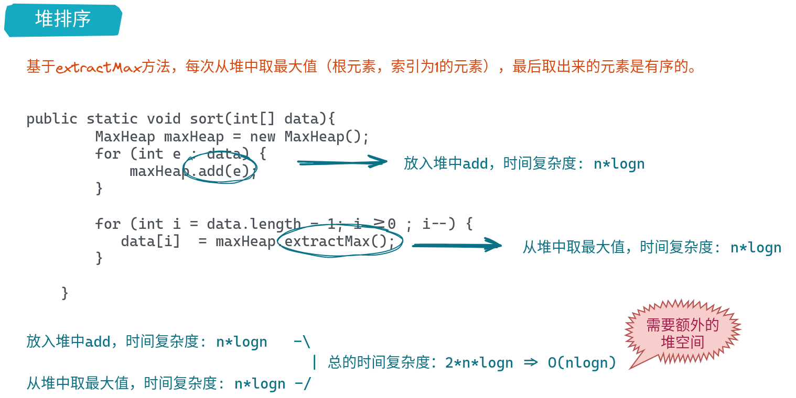
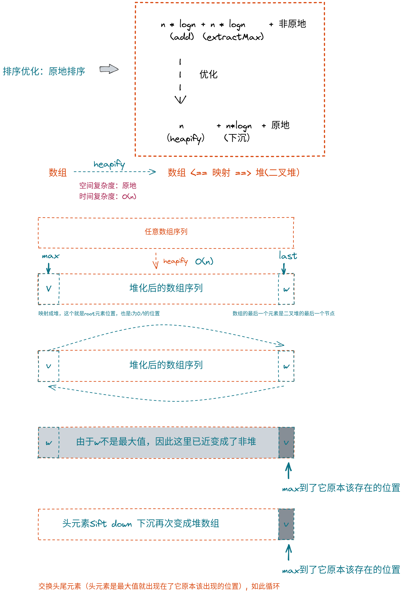

# 堆


> :books: 特征
> 1. 完全二叉树：底层使用数组实现，数组的最后一位是整个树的最后一个节点
> 2. 最大堆，根元素也就是索引为1的元素是整个堆（树）的最大值


## 使用数组实现索引和节点串联关系算法


## 向堆中添加元素


## 向堆中取出元素(最大元素也是根元素)


## 时间复杂度分析


## 堆排序



## replace & heapify


## 排序算法的优化




## 代码实现


```java

import java.util.*;
import java.util.stream.Collectors;
import java.util.stream.Stream;

public class MaxHeap {


    private List<Integer> data;

    public MaxHeap(int capacity){
        this.data = new ArrayList<>(capacity);
        this.data.add(null);
    }

    public MaxHeap(){
        this.data = new ArrayList<>();
        this.data.add(null);
    }


    public MaxHeap(int[] arr){
        this.data = Stream.concat(Stream.of(0), Arrays.stream(arr).boxed()).collect(Collectors.toList());
        for (int i = parent(data.size() - 1); i > 0 ; i--) {
            siftDown(i);
        }
    }


    /**
     * 返回堆中元素的个数
     */
    public int size(){
        return data.size() - 1;
    }

    /**
     * 是否为空
     */
    public boolean isEmpty(){
        return data.size() == 1;
    }

    /**
     * 向堆中添加元素
     */
    public void add(int e){

        int i = data.size();
        data.add(i, e);
        siftUp(i);
    }


    /**
     * 上浮
     */
    private void siftUp(int i){
        while(i > 1 && data.get(parent(i)) < data.get(i)){
            Collections.swap(data, i, parent(i));
            i = parent(i);
        }
    }


    /**
     * 最带大值
     */
    public int findMax(){
        if (data.size() == 1){
            throw new IllegalArgumentException("heap is empty");
        }
        return data.get(1);
    }

    /**
     * 移除最大值
     */
    public int extractMax(){
        System.out.println(data.toString());
        int max = findMax();

        Collections.swap(data, 1, data.size() - 1);
        data.remove(data.size() - 1);
        siftDown(1);
        return max;
    }

    /**
     * 下沉
     */
    private void siftDown(int i){

        while(leftChild(i) < data.size() ){
            int j = leftChild(i);
            if (j+1 < data.size() && data.get(j + 1) > data.get(j)){
                j = j+1;
            }
            if (data.get(i) >= data.get(j)){
               break;
            }
            Collections.swap(data, i, j);
            i = j;
        }
    }

    /**
     * 取出堆中最大的元素，替换成元素e
     */
    public int replace(int e){
        int max = findMax();

        data.set(1, e);
        siftDown(1);

        return max;
    }


    public void sort(){

        int size = data.size();
        while (size > 1){

            Collections.swap(data, 1, size - 1);
            siftDown2(1, size-1);
            size--;
        }

    }


    /**
     * 下沉
     */
    private void siftDown2(int i, int k){

        while(leftChild(i) < k ){
            int j = leftChild(i);
            if (j+1 < k && data.get(j + 1) > data.get(j)){
                j = j+1;
            }
            if (data.get(i) >= data.get(j)){
                break;
            }
            Collections.swap(data, i, j);
            i = j;
        }
    }


    /**
     * 返回完全二叉树的数组表示中，一个索引所表示的元素的父亲节点的索引
     */
    private int parent(int i){
        if (i<=1){
            throw new IllegalArgumentException("index <= 1 doesn't have parent");
        }
        return i/2;
    }

    /**
     * 返回完全二叉树的数组表示中，一个索引所表示的元素的左孩子节点的索引
     */
    private int leftChild(int i){
        if (i<=0){
            throw new IllegalArgumentException("index 0 doesn't have left child");
        }
        return 2 * i;
    }

    /**
     * 返回完全二叉树的数组表示中，一个索引所表示的元素的右孩子节点的索引
     */
    private int rightChild(int i){
        if (i<=0){
            throw new IllegalArgumentException("index 0 doesn't have right child");
        }
        return 2 * i + 1;
    }


}

``` 


