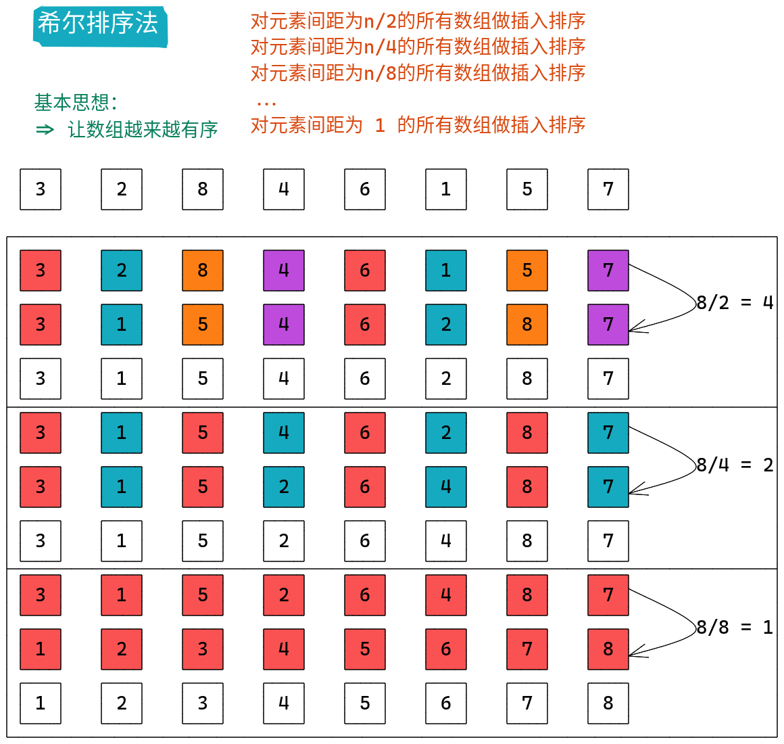

# 希尔排序法




```java
/**
 * 希尔排序法
 */
public static void sort(int[] data) {
    //数组的间隔
    int h = data.length / 2;
    //只要子数组的间隔>=1,那么就插入排序
    while ( h>=1 ){

        for (int start = 0; start < h; start++) {
            //对 data[start, start + h, start + 2h, start + 3h ...]
            //插入排序
            for (int i = start; i < data.length; i+=h) {
                int t = data[i];
                int j;
                for (j = i; j - h >= 0 && t < data[j - h]; j-= h){
                    data[j] = data[j - h];
                }
                data[j] = t;
            }
        }
        
        h /= 2;
    }
}
```


