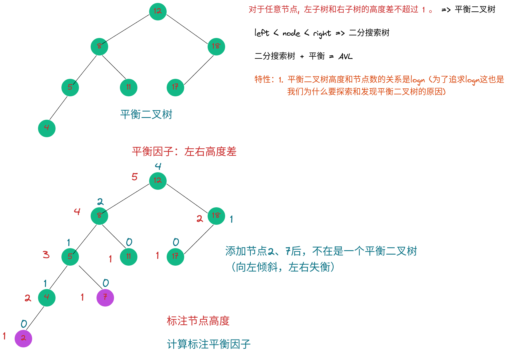

# 平衡二叉树

* AVL：是最为经典的平衡二叉树
  - AVL是发明人名称的首字母：G.M. Adelson-Velsky 和 E.M. Landis
  - 1962年论文首次提出
  - 最早的自平衡二分搜索树结构

> 我们前面学的二分搜索树不是平衡二叉树，最坏的情况下，会退化成链表

* 满二叉树是平衡二叉树
* 完全二叉树是一种平衡二叉树（堆：二叉堆（父>子））
* 线段树也是一种平衡二叉树(线段树是被看作是满二叉树)

## 定义

* 平衡二叉树：对于任意一个节点，左子树和右子树的高度相差不能超过1

> 叶子节点的高度一定是1 => 新添加节点的高度一定是1

