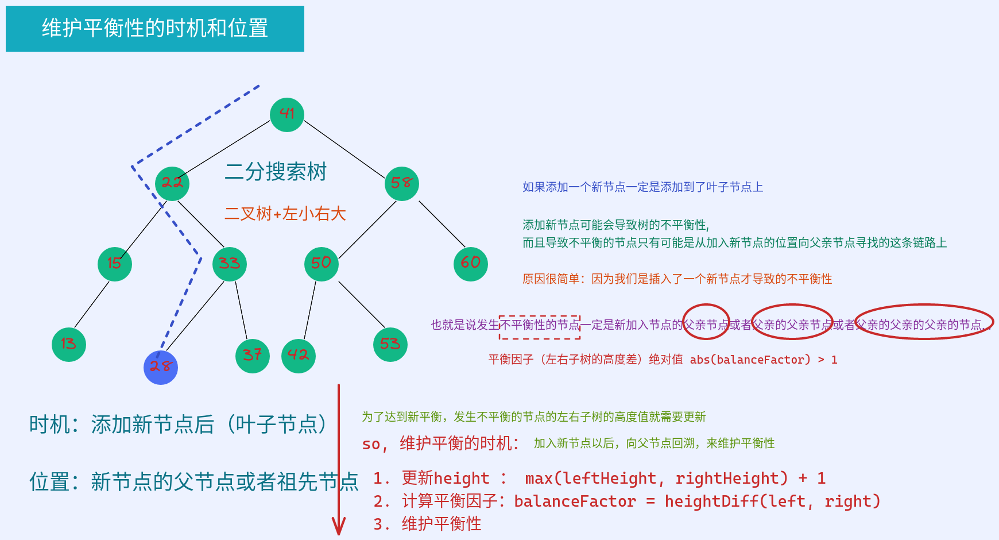
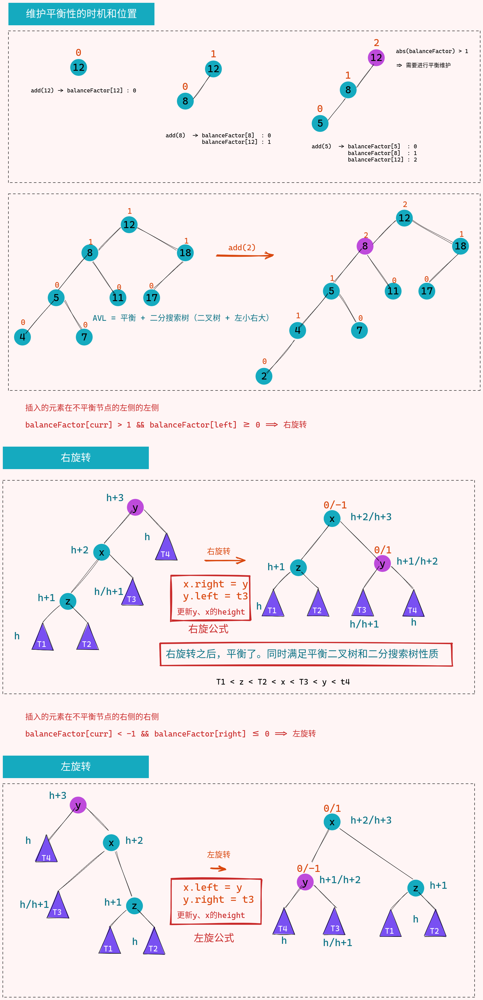
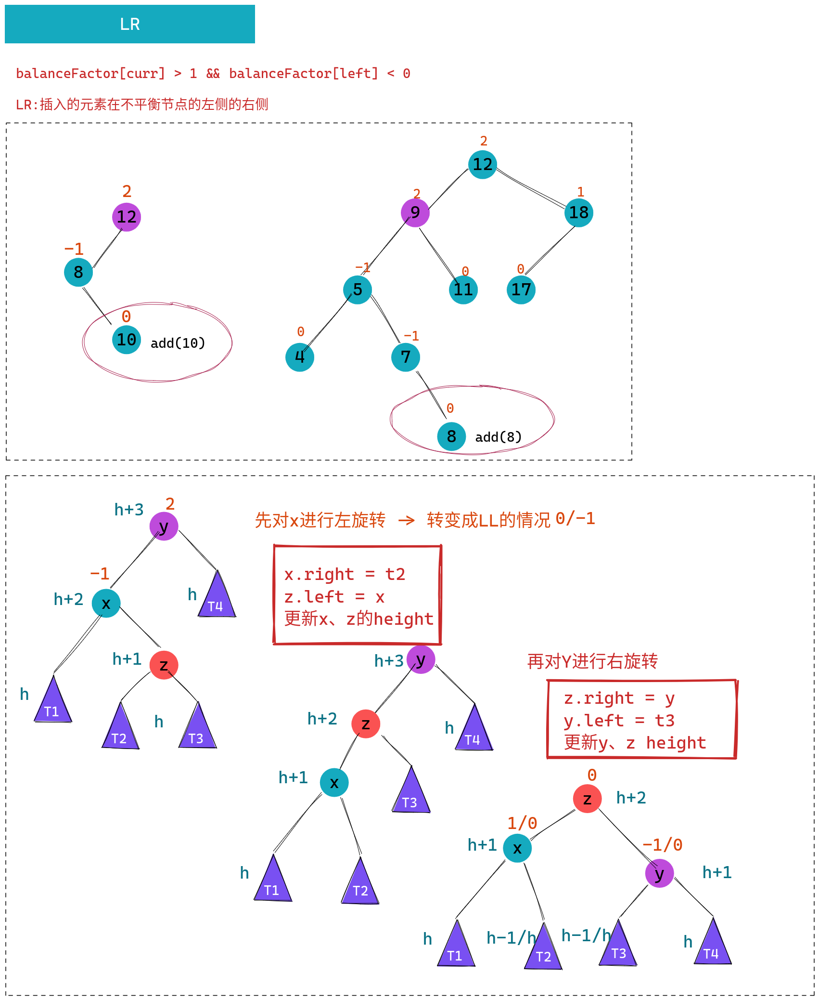
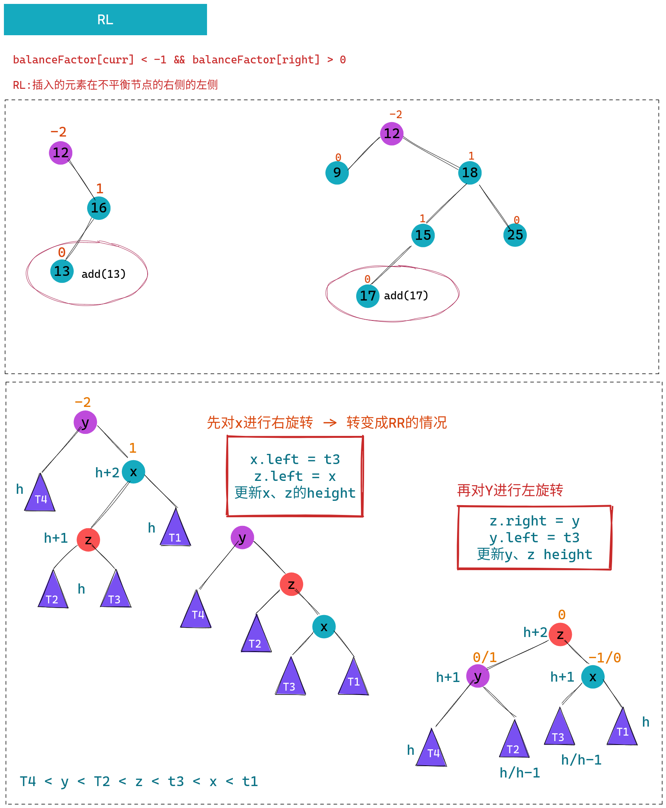
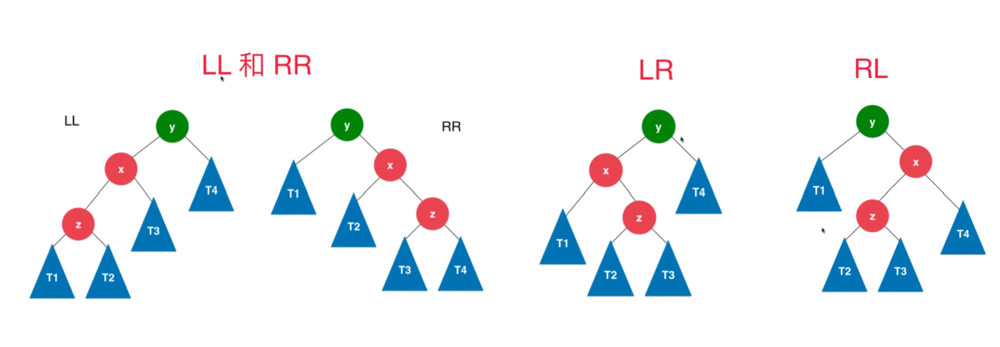

# 平衡二叉树

* AVL：是最为经典的平衡二叉树
  - AVL是发明人名称的首字母：G.M. Adelson-Velsky 和 E.M. Landis
  - 1962年论文首次提出
  - 最早的自平衡二分搜索树结构

> 我们前面学的二分搜索树不是平衡二叉树，最坏的情况下，会退化成链表

* 满二叉树是平衡二叉树
* 完全二叉树是一种平衡二叉树（堆：二叉堆（父>子））
* 线段树也是一种平衡二叉树(线段树是被看作是满二叉树)

> 为什么要研究平衡二叉树呢？因为平衡二叉树的高度稳定的logn, 时间复杂度logn

## 定义

* 平衡二叉树：对于任意一个节点，左子树和右子树的高度相差不能超过1

> 叶子节点的高度一定是1 => 新添加节点的高度一定是1

## 左旋转和右旋转

> 1. 如果插入一个新节点，一定是插入到叶子节点

### LL & RR

### LR

### RL

### 总结

> 1. 插入的元素在不平衡节点的左侧的左侧, balanceFactor[curr] > 1  && balanceFactor[left]  >= 0 => LL => 当前节点右旋转
> 2. 插入的元素在不平衡节点的右侧的右侧, balanceFactor[curr] < -1 && balanceFactor[right] <= 0 => RR => 当前节点左旋转
> 3. 插入的元素在不平衡节点的左侧的右侧, balanceFactor[curr] > 1  && balanceFactor[left]  <  0 => LR => 先对左子节点左旋转,再对当前节点右旋转
> 4. 插入的元素在不平衡节点的右侧的左侧, balanceFactor[curr] < -1 && balanceFactor[right] >  0 => RL => 先对右子节点右旋转,再对当前节点左旋转

## 删除节点

1. 和添加节点类似，因为删除的节点可能破坏树的平衡，需要对被删除节点的父节点（依次往上找父）的平衡性再次维护，维护的准则就是LL/RR/LR/RL
2. 平衡树，diff(lh, rh) 不超过 1 ，平衡树的子树仍然是一颗平衡树，因此，被删除节点的子树不用维护（平衡性不会被打破），会打破平衡性的只能是向上走的父节点

