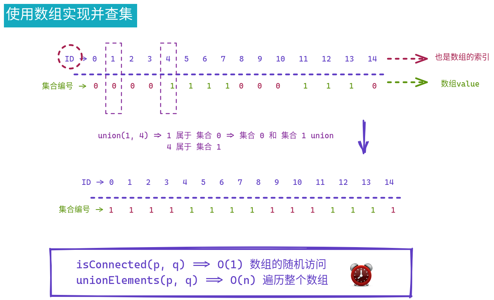
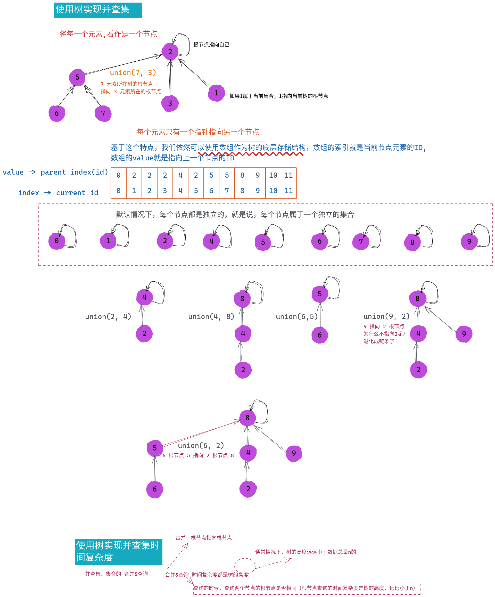
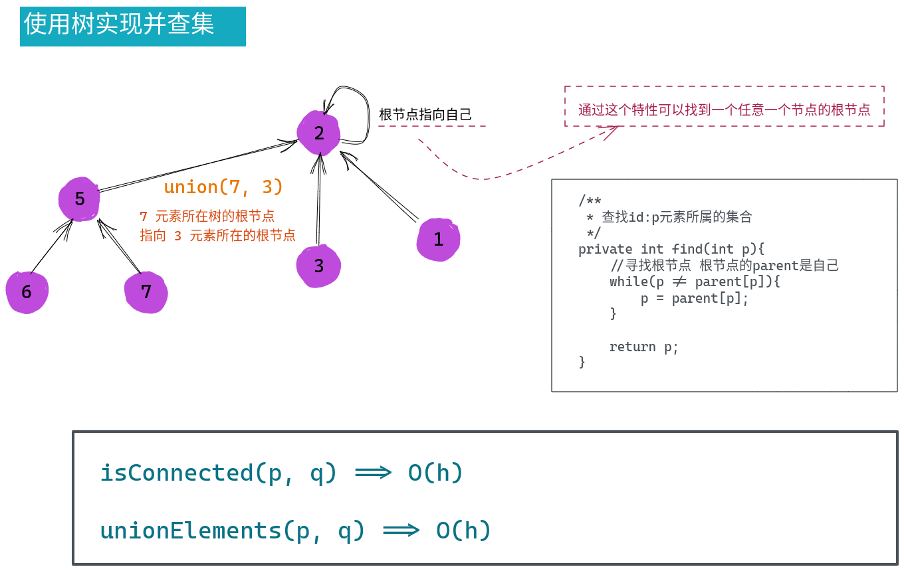
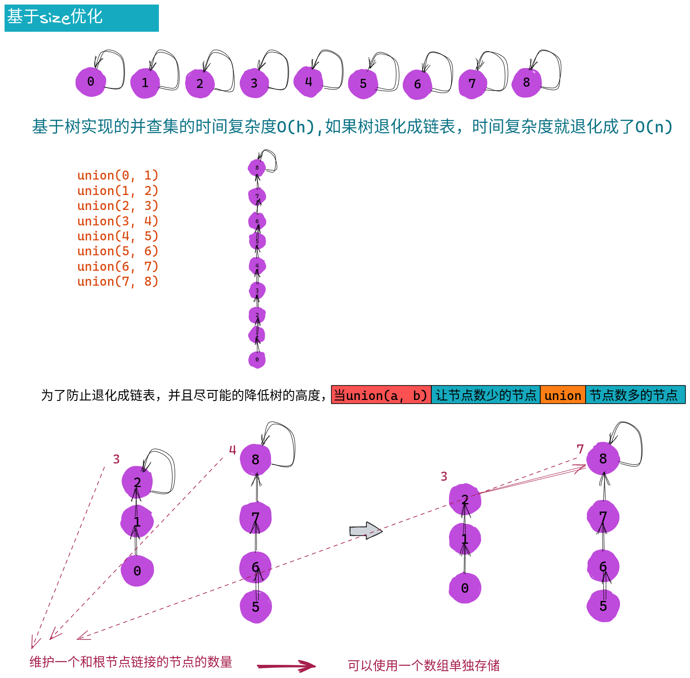
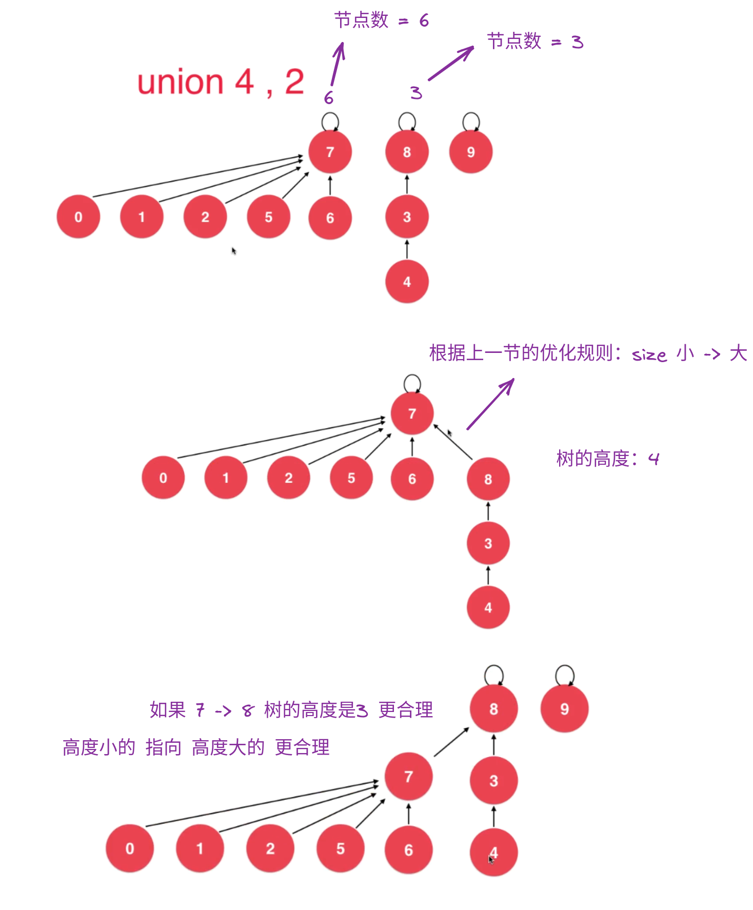
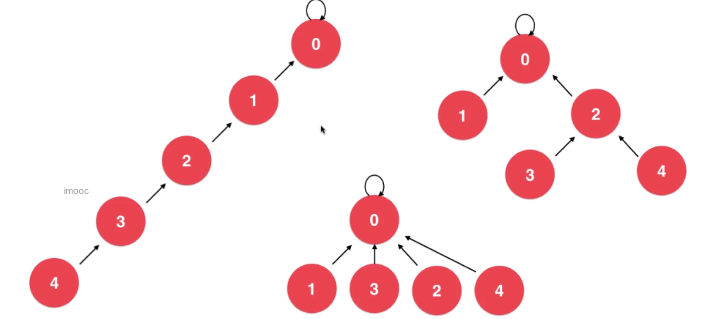
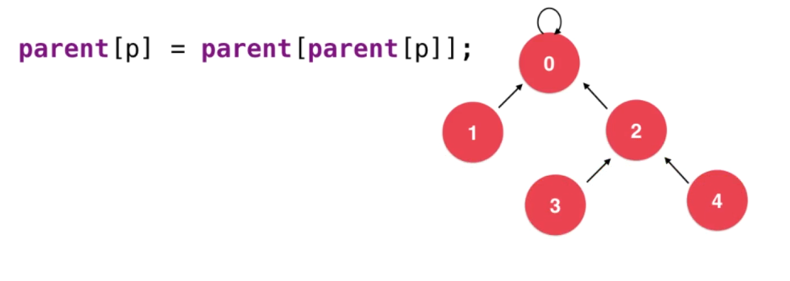

# 并查集

* 连接问题
  * e.g. 网络中节点与节点之间的连接状态
  * e.g. 打几个电话可以联系到国家主席

* 数学中集合类的实现
  * 尤其是两个集合的并集（这也是“并查集”中“并”的含义；“查”就是查询的意思）

* 对于一组数据，主要支持两个动作：
  * union(p, q), 将两个数据以及他们所在的集合合并起来
  * isConnected(p, q), 查询对于给定的两个数据，他们是否属于同一个集合

## 功能定义


```java
public interface UF {

    /**
     * 返回元素的个数
     */
    int getSize();

    /**
     * 两个元素是否连接:查
     */
    boolean isConnected(int p, int q);

    /**
     * 连接两个元素：并 
     */
    void unionElements(int p, int q);


}
```

> :books: 为什么使用int参数？
> 这是因为我们并不需要关心具体元素是什么或者是谁
> 我们只需要关心 id:p & id:q 的两个元素是否相连
> 也就是，我们可以将元素和元素所在的数组的索引做一个映射（因为所在数组的索引可以看作是所在数据库表中的id主键）
 

## 使用数组实现并查集



```java
public class UnionFind1 implements UF{

    private int[] ids;

    public UnionFind1(int size){
        ids = new int[size];
        //每个并查集元素独立，属于一个独立的集合
        for (int i = 0; i < ids.length; i++) {
            ids[i] = i;
        }
    }


    @Override
    public int getSize() {
        return ids.length;
    }

    @Override
    public boolean isConnected(int p, int q) {
        return find(p) == find(q);
    }

    @Override
    public void unionElements(int p, int q) {
        int pID = find(p);
        int qID = find(q);
        if (pID == qID){
            return;
        }
        for (int i = 0; i < ids.length; i++) {
            if (ids[i] == pID){
                ids[i] = qID;
            }
        }
    }


    /**
     * 查找id:p元素所属的集合
     */
    private int find(int p){
        return ids[p];
    }

}

```

## 使用树实现并查集







```java

public class Unionfind2 implements UF{


    private int[] parent;


    public Unionfind2(int size){
        this.parent = new int[size];
        //初始化 每个元素是自己本身独立集合
        for (int i = 0; i < parent.length; i++) {
            parent[i] = i;
        }
    }


    @Override
    public int getSize() {
        return parent.length;
    }

    @Override
    public boolean isConnected(int p, int q) {
        return find(p) == find(q);
    }

    @Override
    public void unionElements(int p, int q) {
        int pRoot = find(p);
        int qRoot = find(q);
        parent[pRoot] = qRoot;

    }

    /**
     * 查找id:p元素所属的集合
     */
    private int find(int p){
        //寻找根节点 根节点的parent是自己
        while(p != parent[p]){
            p = parent[p];
        }

        return p;
    }

}

```

## 基于size优化




```java

public class Unionfind3 implements UF{


    private int[] parent;
    private int[] sz;


    public Unionfind3(int size){
        this.parent = new int[size];
        //初始化 每个元素是自己本身独立集合
        for (int i = 0; i < parent.length; i++) {
            parent[i] = i;
            sz[i] = 1;
        }
    }


    @Override
    public int getSize() {
        return parent.length;
    }

    @Override
    public boolean isConnected(int p, int q) {
        return find(p) == find(q);
    }

    @Override
    public void unionElements(int p, int q) {
        int pRoot = find(p);
        int qRoot = find(q);
        if (sz[pRoot] < sz[qRoot]){
            parent[pRoot] = qRoot;
            sz[qRoot] += sz[pRoot];
        }else {
            parent[qRoot] = pRoot;
            sz[pRoot] += sz[qRoot];
        }


    }

    /**
     * 查找id:p元素所属的集合
     */
    private int find(int p){
        //寻找根节点 根节点的parent是自己
        while(p != parent[p]){
            p = parent[p];
        }

        return p;
    }

}

```


## 基于rank的优化




```java

public class Unionfind4 implements UF{


    private int[] parent;
    private int[] rank;


    public Unionfind4(int size){
        this.parent = new int[size];
        //初始化 每个元素是自己本身独立集合
        for (int i = 0; i < parent.length; i++) {
            parent[i] = i;
            rank[i] = 1;
        }
    }


    @Override
    public int getSize() {
        return parent.length;
    }

    @Override
    public boolean isConnected(int p, int q) {
        return find(p) == find(q);
    }

    @Override
    public void unionElements(int p, int q) {
        int pRoot = find(p);
        int qRoot = find(q);
        if (rank[pRoot] < rank[qRoot]){
            parent[pRoot] = qRoot;
        }else if(rank[pRoot] > rank[qRoot]) {
            parent[qRoot] = pRoot;
        }else {
            parent[qRoot] = pRoot;
            rank[pRoot] += 1;
        }


    }

    /**
     * 查找id:p元素所属的集合
     */
    private int find(int p){
        //寻找根节点 根节点的parent是自己
        while(p != parent[p]){
            p = parent[p];
        }

        return p;
    }

}

```

## 路径压缩 path compression






```java
/**
 * 查找id:p元素所属的集合
 */
private int find(int p){
    //寻找根节点 根节点的parent是自己
    while(p != parent[p]){
        parent[p] = parent[parent[p]];
        p = parent[p];
    }

    return p;
}
```


