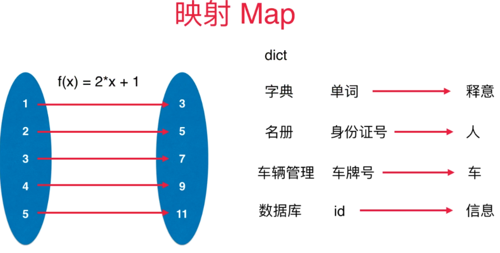
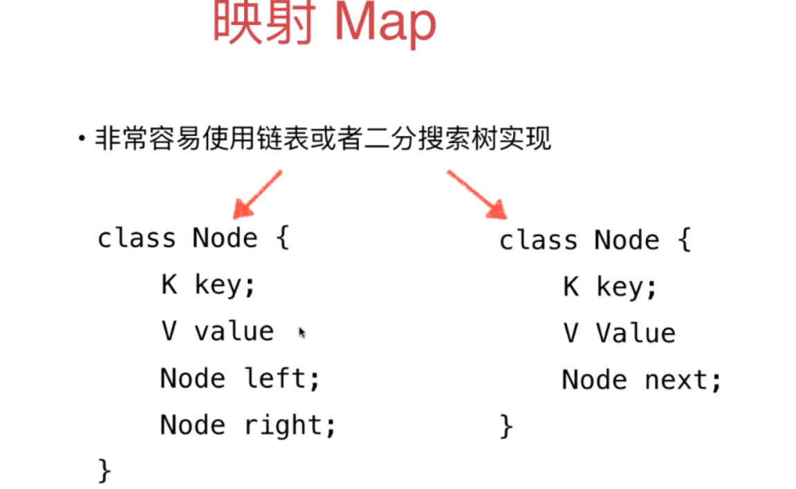
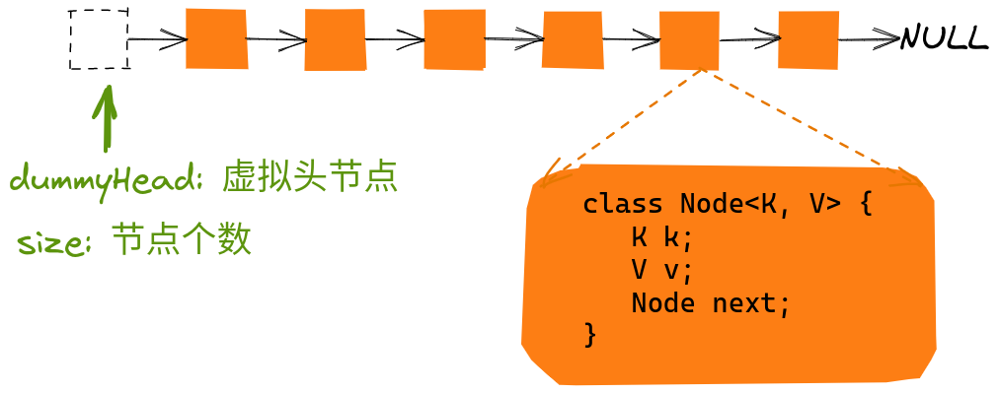
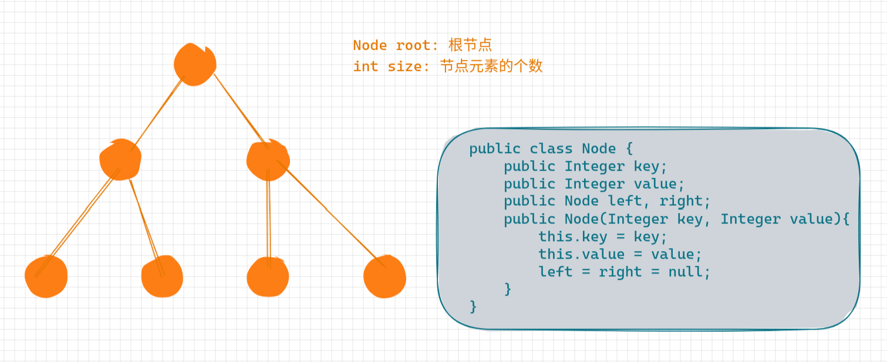
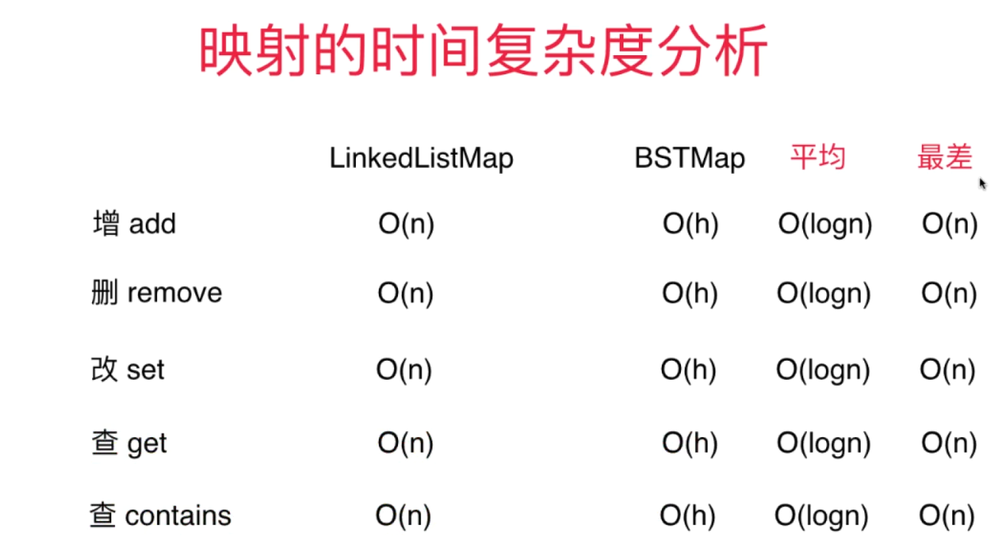

# 映射

## 特性

* key-value键值对






## API

<big>`Map<K, V>`</big>

* void add(K, V)
* V remove(K)
* boolean contains(K)
* V get(K)
* void set(K, V)
* int getSize()
* boolean isEmpty()


## 实现方式


```java
public interface Map {
    void add(Integer key, Integer value);
    Integer remove(Integer key);
    boolean contains(Integer key);
    Integer get(Integer key);
    void set(Integer key, Integer value);
    Integer getSize();
    boolean isEmpty();
}
```

### 基于链表的实现方式LinkedList



```java
public class LinkedListMap implements Map{

    private Node dummyHead;

    private int size;

    public LinkedListMap(){
        dummyHead = new Node();
        size = 0;
    }

    private Node getNode(Integer key){
        Node cur = dummyHead.next;
        while (cur != null){
            if (cur.key.equals(key)){
                return cur;
            }
            cur = cur.next;
        }
        return null;
    }


    @Override
    public void add(Integer key, Integer value) {
        Node node = getNode(key);
        if (node == null) {
            dummyHead.next = new Node(key, value, dummyHead.next);
            size++;
        }else {
            node.value = value;
        }
    }

    @Override
    public Integer remove(Integer key) {

        Node pre = dummyHead;
        while (pre.next != null){
            if (pre.next.key.equals(key)){
                break;
            }
            pre = pre.next;
        }
        if (pre.next != null){
            Node delNode = pre.next;
            pre.next = delNode.next;
            delNode.next = null;
            return delNode.value;
        }
        return null;
    }

    @Override
    public boolean contains(Integer key) {
        return getNode(key) != null;
    }

    @Override
    public Integer get(Integer key) {
        Node node = getNode(key);
        return node == null ? null : node.value;
    }

    @Override
    public void set(Integer key, Integer value) {
        Node node = getNode(key);
        if (node == null){
            throw new IllegalArgumentException(key + "not exist!");
        }
        node.value = value;
    }

    @Override
    public Integer getSize() {
        return size;
    }

    @Override
    public boolean isEmpty() {
        return size == 0;
    }

    private static class Node {
        public Integer key;
        public Integer value;
        public Node next;
        public Node(Integer key, Integer value, Node next){
            this.key = key;
            this.value = value;
            this.next = next;
        }
        public Node(Integer key){
            this(key, null, null);
        }
        public Node(){
            this(null, null, null);
        }

        @Override
        public String toString() {
            return "Node{" +
                    "key=" + key +
                    ", value=" + value +
                    '}';
        }
    }
}

```


### 基于二叉树的实现方式





## 时间复杂度




