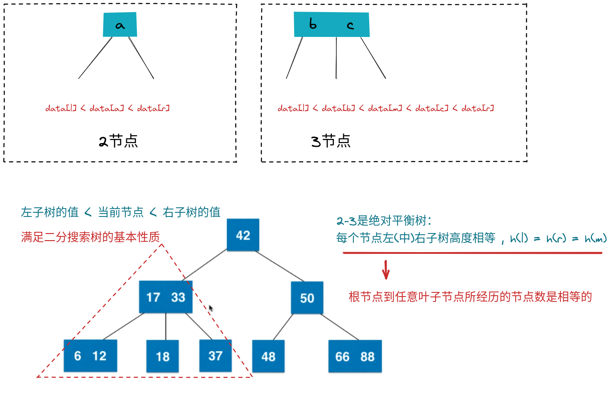

# 红黑树

* 历史上最负盛名的树结构
* 二分搜索树的一种，
* 不是平衡二叉树，但是是"黑平衡"的二叉树（左右子树的黑色节点的高度是绝对平衡的，也就是黑色节点的高度是相等的）
  - 黑色节点对应的就是2-3输的2节点或者3节点
* 最大高度是2logn 忽略常数，O(logn) => 添加、删除、查询都是O(logn) 

> 红黑树的高度可能是2倍avl树的高度，查询上时间复杂度可能会相差一倍，但是在添加和删除元素上要远远高于AVL树（AVL树要左右旋）

## 算法导论中的定义

1. 每个节点或者是红色或者是黑色
2. 根节点是黑色的
3. 每个叶子节点（最后的空节点）是黑色的
4. 如果一个节点是红色的，那么他的两个孩子节点都是黑色的
5. 从任意一个节点到叶子节点，经过的黑色节点是一样的

> * <mark>上面的定义太生硬</mark>
> * <big>红黑树与2-3树的等价性、理解2-3树和红黑树之间的关系、红黑树并不难</big>
>> :books: 学习2-3树，不仅对理解红黑树有帮助，对于理解B类树，也有巨大的帮助！

## 2-3树

1. 满足二分搜素树的基本性质
2. 节点可以存放一个元素或者两个元素
3. **2-3树是一颗绝对平衡的树（绝对平衡的树：左右子树的高度是相等的）**

    * 绝对平衡的树，从根节点到任意一个叶子节点所进过的节点数是相同的(所有叶子节点的深度是相同的)

### 2-3树的绝对平衡性

## 红黑树与2-3树等价性

> 在2-3树中，只有两种节点，2节点、3节点 2节点对应的是黑节点；3节点对应的是以黑节点为根节点的黑红节点
> 新添加的节点都是以红色姿态被添加进来，会升级为黑色节点

