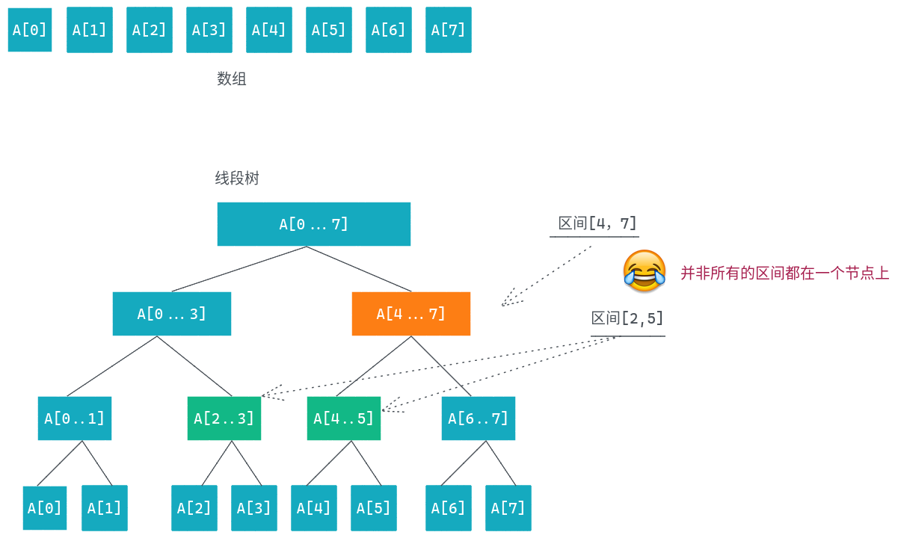
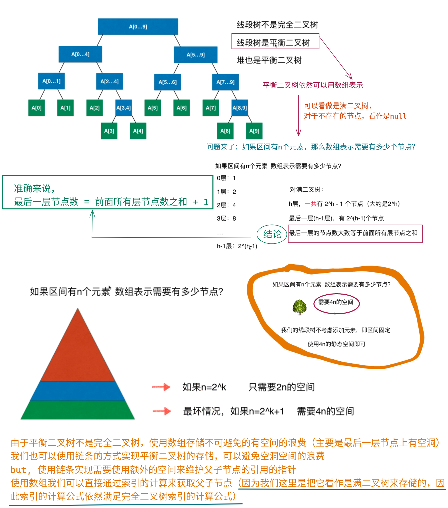
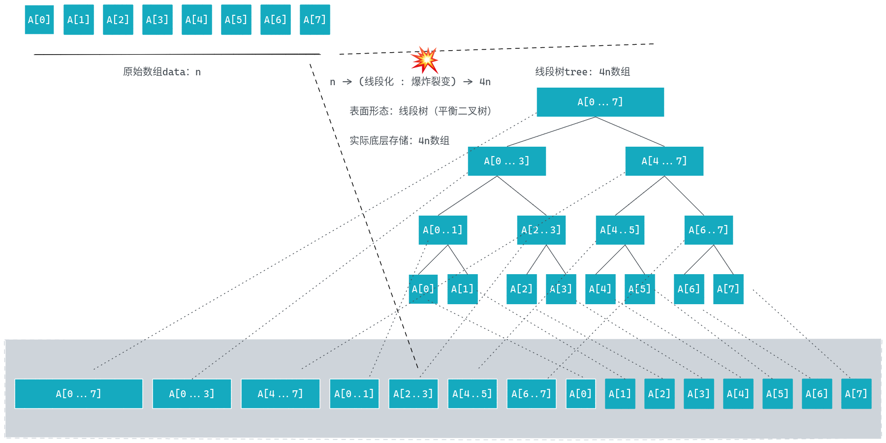
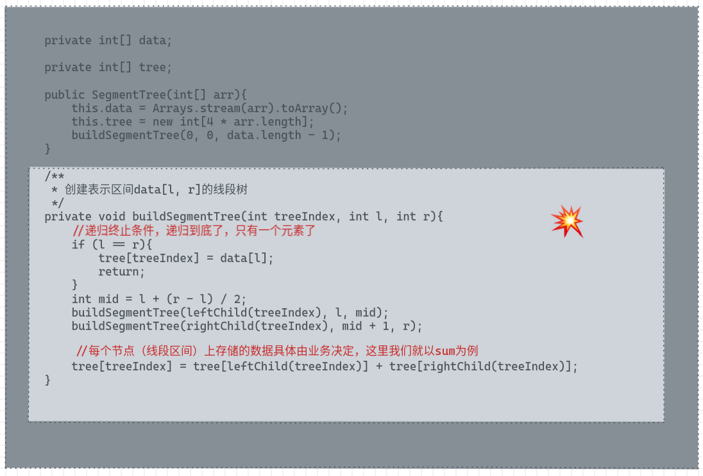
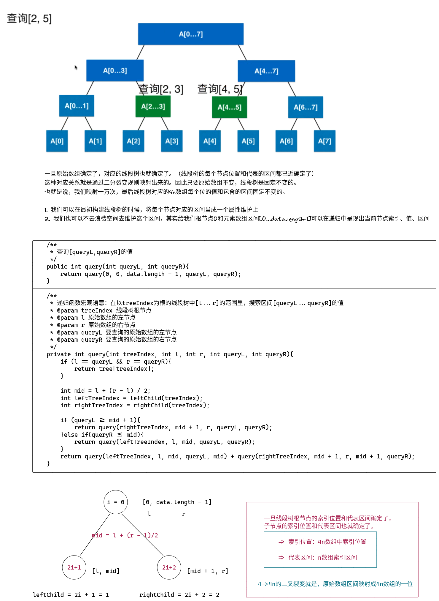

# 线段树

* 为什么要使用线段树？

  * 对于有一类问题, 我们关心的是线段（或者区间）

  * 最经典的线段树问题：区间染色

    * 有一面墙, 长度为n, 每次选择一段墙进行染色
    * m 次操作以后, 我们可以看见多少种颜色？
    * m 次操作以后, 我们可以在[i, j]区间内看见多少种颜色？

  * 另一类经典问题：区间查询

    * 查询一个区间[i, j]的最大值、最小值或者区间数字和
    * 2017年注册用户中消费最高的用户？消费最少的用户？学习时长最长的用户？


|         操作         | 使用数组实现 | 使用线段树 |
|        -----         | -----        | -----      |
| 染色操作（更新区间） | O(n)         | O(logn)    |
| 查询操作（查询区间） | O(n)         | O(logn)    |


    +----+----+----+----+----+----+---+----+----+----+----+----+----+----+----+----+
    | 32 | 26 | 17 | 55 | 72 | 19 | 8 | 46 | 22 | 68 | 28 | 33 | 62 | 92 | 53 | 16 |
    +----+----+----+----+----+----+---+----+----+----+----+----+----+----+----+----+
      0    1   2    3    4    5    6    7    8    9    10   11   12   13   14   15


* 对于给定区间

  * 更新：跟新区间中一个元素或者一个区间的值
  * 查询：查询区间中最大值max、最小值min 或者sum


## 什么是线段树




> :books: 线段树
> 1. 不一定是一个满的二叉树也不一定是一个完全二叉树
> 2. 叶子节点不完全在最后一层，也有可能在倒数第二层
> 3. **线段树是一个平衡二叉树**


### 平衡二叉树

* 定义：对于整棵树来说,它的**最大深度**和**最小深度**他们之间的查**最多只有可能为1.**
* 平衡二叉树不会退化成链表，节点个数和整个树高度的关系一定是logn的关系

> 堆（二叉堆）就是一颗平衡二叉树，完全二叉树本身就是一个平衡二叉树

### 平衡二叉树底层也可以用数组存储




### 线段树的构建





```java
public class SegmentTree {

    private int[] tree;

    private int[] data;

    public SegmentTree(int[] arr){
        this.data = Arrays.stream(arr).toArray();
        this.tree = new int[4 * arr.length];
        buildSegmentTree(0, 0, data.length - 1);
    }

    /**
     * 创建表示区间data[l, r]的线段树
     */
    private void buildSegmentTree(int treeIndex, int l, int r){
        //递归终止条件，递归到底了，只有一个元素了
        if (l == r){
            tree[treeIndex] = data[l];
            return;
        }
        int mid = l + (r - l) / 2;
        buildSegmentTree(leftChild(treeIndex), l, mid);
        buildSegmentTree(rightChild(treeIndex), mid + 1, r);
        //每个节点（线段区间）上存储的数据具体由业务决定，这里我们就以sum为例
        tree[treeIndex] = tree[leftChild(treeIndex)] + tree[rightChild(treeIndex)];
    }

    public int get(int index){
        return data[index];
    }

    public int size(){
        return data.length;
    }


    private int leftChild(int index){
        return 2 * index + 1;
    }

    private int rightChild(int index){
        return 2 * index + 2;
    }

    @Override
    public String toString() {
        return Arrays.toString(tree);
    }
}

```


## 线段树的查询操作




## 线段树的跟新操作


```java
    public void set(int index, int val){

        data[index] = val;

        set(0, 0, data.length - 1, index, val);
    }

    private void set(int treeIndex, int l, int r, int index, int val){
        if (l == r){
            tree[treeIndex] = val;
            return;
        }

        int mid = l + (r - l) / 2;
        int leftChild = leftChild(treeIndex);
        int rightChild = rightChild(treeIndex);

        if (mid + 1 <= index){
            set(rightChild, mid + 1, r, index, val);
        }else {
            set(leftChild, l, mid, index, val);
        }

        tree[treeIndex] = tree[leftChild] + tree[rightChild];


    }

```


