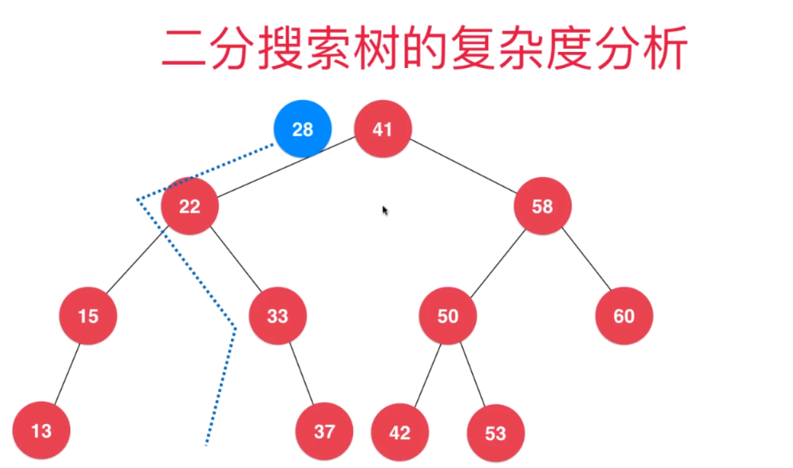
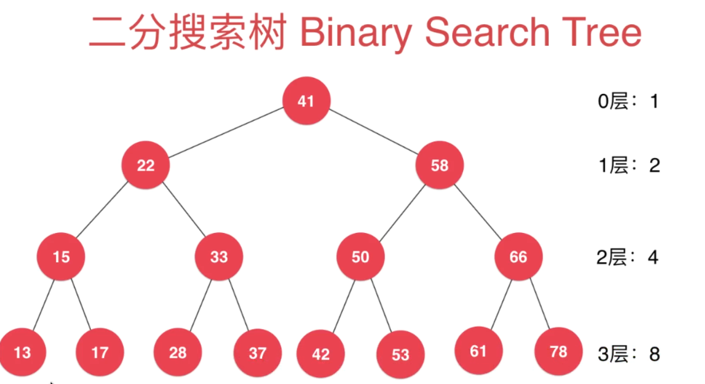
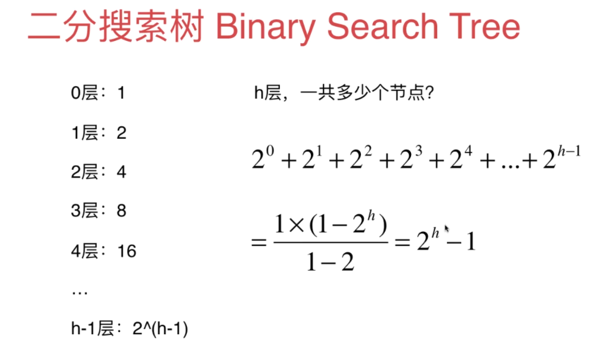
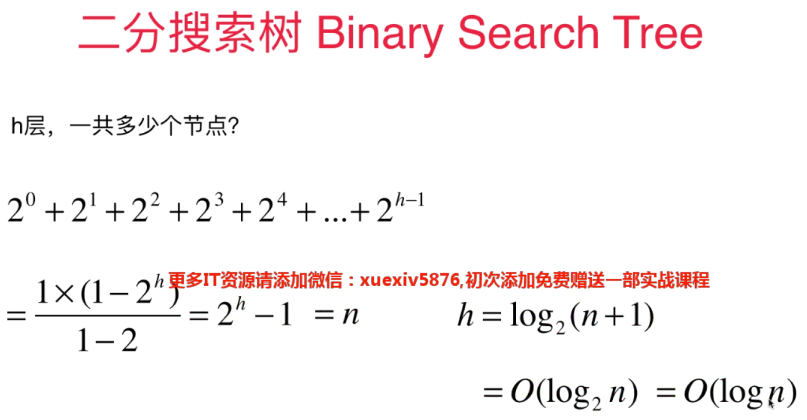
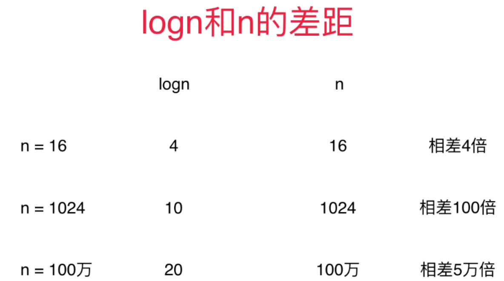
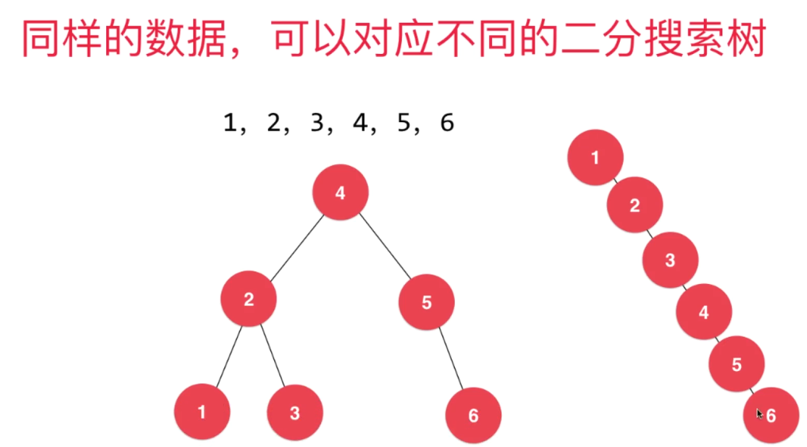
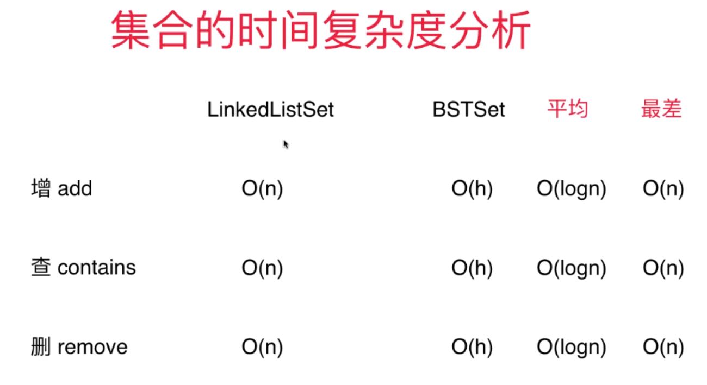

# 集合 Set

## 特性

* 去重


## API

<big>**`Set<E>`**</big>

* void add(E) <font color='red'> <<<== </font> [不能添加重复元素]()
* void remove(E)
* boolean contains(E)
* int getSize()
* boolean isEmpty()


## 代码实现

```java
public interface Set {

    void add(int e);
    void remove(int e);
    boolean contains(int e);
    int getSize();
    boolean isEmpty();

}
```

### 基于二分搜索树实现

BinarySearchTree的实现可以参考[二分搜索树](二分搜索树_2022_03_15.md#二分搜索树操作相关代码演示)

```java
public class BSTSet implements Set{

    private BinarySearchTree bst;

    public BSTSet() {
        this.bst = new BinarySearchTree();
    }

    @Override
    public void add(int e) {
        bst.add(e);
    }

    @Override
    public void remove(int e) {
        bst.remove(e);
    }

    @Override
    public boolean contains(int e) {
        return bst.contains(e);
    }

    @Override
    public int getSize() {
        return bst.size();
    }

    @Override
    public boolean isEmpty() {
        return bst.size() == 0;
    }
}

```


### 基于链表的实现

底层链表我们借助jdk的LinkedList(java.util.LinkedList)

```java
public class LinkedListSet implements Set{


    private LinkedList<Integer> linkedList;


    public LinkedListSet() {
        this.linkedList = new LinkedList<>();
    }

    @Override
    public void add(int e) {
        if (!linkedList.contains(e)){
            linkedList.addFirst(e);
        }
    }

    @Override
    public void remove(int e) {
        linkedList.remove(e);
    }

    @Override
    public boolean contains(int e) {
        return linkedList.contains(e);
    }

    @Override
    public int getSize() {
        return linkedList.size();
    }

    @Override
    public boolean isEmpty() {
        return linkedList.isEmpty();
    }
}
```

## 总结

> 1. 我们这里使用的基于二分搜索树实现的集合是一个有序的集合（包括jdk自己的TreeSet是基于平衡二叉树更具体一点是红黑树实现的也是一个有顺序的集合）
> 2. 基于链表LinkedList实现的集合是没有顺序性的, 基于链表实现的无序的集合效率太低，后期还有哈希表实现的无序的集合,基于哈希表实现的集合性能更强劲HashSet.比TreeSet性能还强
> 3. 功能越强大、性能越低，这个一个哲学问题。可以认为是一个不变的真理。因此我们在使用的时候，尽量选择能够满足需求的低级就可以。e.g. HashSet -> LinkedHashSet -> TreeSet
> 4. 一般我们说的集合都是不可重复的（去重），但是guava的MultiSet可以保存重复的元素


## 时间复杂度分析




> 二分搜索树的时间复杂度，和树的高度（深度depth）有关系



> 最好的情况下，满的二分搜索树（“满”，每个节点都有左右子节点）





> 最差的情况,二分搜索树会退化成链表，深度就编程了n,时间复杂度就退化成了O(n)
> 后面我们会学习平衡二叉树（二叉树进化的变（异）种）来避免这种情况




> 总结




